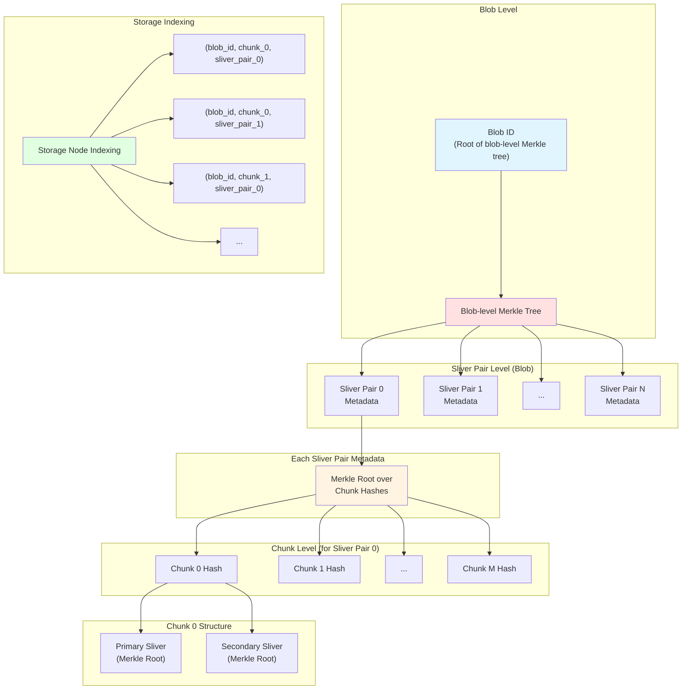

# Walrus

A decentralized blob store using [Sui](https://github.com/MystenLabs/sui) for coordination and
governance.

## Documentation

Our main documentation is available [as a Walrus Site](https://docs.wal.app) (see [the
documentation](https://docs.wal.app/walrus-sites/intro.html) for further information on what
this means) and on [GitHub Pages](https://mystenlabs.github.io/walrus); it is generated using
[mdBook](https://rust-lang.github.io/mdBook/) from source files in the [`docs/book`](./docs/book)
directory.

You can also build the documentation locally (assuming you have Rust installed):

```sh
cargo install mdbook mdbook-admonish mdbook-katex mdbook-linkcheck mdbook-tabs --locked
cargo install --git https://github.com/MystenLabs/mdbook-template --locked
mdbook serve
```

After this, you can browse the documentation at <http://localhost:3000>.

There are some additional documentation resources:

- Usage examples are available under [docs/examples](./docs/examples/).
- Our encoding system, which we call *Red Stuff*, is described in detail in
  [docs/red-stuff.md](docs/red-stuff.md).
- All our code is covered by Rust docs. You can build these and open them in your web browser by
  running the following:

  ```sh
  cargo doc --workspace --open # add `--no-deps` to prevent building docs of all dependencies
  ```

## Repository structure

This repository contains all Walrus-related code, tools, and documentation:

- [`contracts`](./contracts) contains all smart contracts used by Walrus for coordination and governance.
- [`crates`](./crates) contains all Rust crates related to Walrus including binaries for storage nodes
  and clients. See [below](#rust-crates) for further information about those.
- [`docker`](./docker) contains Dockerfiles and docker-compose setups for building and running Walrus.
- [`docs`](./docs) contains high-level technical and design documentation about Walrus.
- [`scripts`](./scripts) contains tools used for evaluating and testing the code. In particular, this
  contains a script to run a local testbed, see [CONTRIBUTING.md](./CONTRIBUTING.md#run-a-local-walrus-testbed).
- [`setup`](./setup) contains setup scripts and configuration files.
- [`testnet-contracts`](./testnet-contracts) contains the Walrus contracts deployed for Walrus
  Testnet. The object IDs of the published contracts are included in the `Move.lock` files.

### Rust crates

Our Rust code is split into several crates with different responsibilities. The main code for Walrus
is contained in the following crates:

<!-- markdownlint-disable proper-names -->
- [walrus-core](crates/walrus-core/) contains core types and functionality, including encoding and
  authentication mechanisms.
- [walrus-storage-node-client](crates/walrus-storage-node-client/) contains (client) interactions
  with storage nodes.
- [walrus-service](crates/walrus-service/) contains client and server functionality including the
  storage backend. This crate also contains all main binaries, in particular `walrus` and
  `walrus-node`.
- [walrus-sui](crates/walrus-sui/) contains all types and interactions with the Sui smart contracts.
- [walrus-utils](crates/walrus-utils/) contains utility functions used in multiple crates.

The following crates contain additional tools that are not part of the main functionality of Walrus
and more extensive tests:

- [checkpoint-downloader](crates/checkpoint-downloader/) contains code to download checkpoints from
  Sui RPC nodes and checkpoint buckets.
- [walrus-e2e-tests](crates/walrus-e2e-tests/) contains end-to-end tests, some of which are also
  run as simulation tests.
- [walrus-orchestrator](crates/walrus-orchestrator/) contains tools to deploy and benchmark
  distributed Walrus networks. This crate is not a default member of the workspace and therefore
  needs to be built explicitly by adding `-p walrus-orchestrator` or `--workspace` to the cargo
  commands.
- [walrus-proc-macros](crates/walrus-proc-macros/) contains procedural macros used in the other
  crates, notably to define simulation tests.
- [walrus-proxy](crates/walrus-proxy/) contains a metrics proxy that authenticates storage nodes and
  collects metrics from them. This crate is not a default member of the workspace and therefore
  needs to be built explicitly by adding `-p walrus-proxy` or `--workspace` to the cargo commands.
- [walrus-simtest](crates/walrus-simtest/) contains simulation tests to ensure that Walrus works
  correctly for all interleavings of concurrent operations and in the presence of crashes.
- [walrus-stress](crates/walrus-stress/) contains a stress client, which is used to put load on
  storage nodes and perform randomized staking re-assignments.
- [walrus-test-utils](crates/walrus-test-utils/) contains test macros and other utilities used in
  the other crates.
<!-- markdownlint-enable proper-names -->

## Using the Walrus client

If you just want to use the Walrus Mainnet or Testnet, please follow the [setup instructions in our
documentation](https://docs.wal.app/usage/setup.html). Further information about the usage is
also available in the [public documentation](https://docs.wal.app/usage/interacting.html).

If you want to build the binary from source or run local tests, see the instructions
[below](#building-from-source-and-testing).

## Hardware requirements

- We assume that this code is executed on at least 32-bit hardware; concretely, we assume that a
  `u32` can be converted safely into a `usize`.
- Servers are assumed to use a 64-bit architecture (or higher); concretely, `usize` has at least 64
  bits.
- Our encoding relies on vector instructions to be efficient. Our default builds assume AVX2 and
  SSSE3 support on x86 CPUs and Neon support on ARM CPUs. Walrus binaries can be built for CPUs
  without these features, but will be much slower.
- When a client is executed on a 32-bit architecture, it may panic for blobs above a certain size.
  Given sufficient physical memory (4 GiB), it is generally possible to encode or decode blobs
  smaller than 500 MiB on 32-bit architectures.

## Building from source and testing

To build Walrus you need to install Rust as described in the [Rust
documentation](https://www.rust-lang.org/tools/install), and the correct Rust toolchain:

```sh
rustup update && rustup toolchain install
```

Then, you can build Walrus using Cargo:

```sh
cargo build # add `--release` for optimized builds
```

You can directly run a local build of the `walrus` binary as `cargo run --bin walrus`. Arguments and
options can be specified after a `--`, for example `cargo run --bin walrus -- store README.md
--epochs 1`.

You can run our test suite by installing [nextest](https://nexte.st/), and then calling `cargo
nextest run`. See [CONTRIBUTING.md](./CONTRIBUTING.md#tests) for further details on our tests and
instructions on how to run a local Walrus testbed.

## Contributing

If you observe a bug or want to request a feature, please search for an existing
[issue](https://github.com/MystenLabs/walrus/issues) on this topic and, if none exists, create a new
one. If you would like to contribute code directly (which we highly appreciate), please familiarize
yourself with our [contributing workflow](./CONTRIBUTING.md).

## License

This project is licensed under the Apache License, Version 2.0 ([LICENSE](LICENSE) or
<https://www.apache.org/licenses/LICENSE-2.0>).

## RS2Chunked Blob Structure

For large blobs that exceed memory limits, Walrus uses a chunked encoding scheme (RS2Chunked) with a two-level Merkle tree structure:



### Smart Defaults - Automatic Chunk Size Selection

The automatic chunk size selection behavior is based on these key parameters:

1. When Chunking Kicks In

Chunking is automatically used when:
blob_size > max_blob_size_for_n_shards(n_shards, encoding_type)

Where:
- max_blob_size_for_n_shards = source_symbols_per_blob × max_symbol_size
- max_symbol_size = 65,534 bytes (u16::MAX - 1) for RS2 encoding
- source_symbols_per_blob = n_primary × n_secondary (depends on shard count)

Example for 1000 shards:
- Primary source symbols: 334
- Secondary source symbols: 667
- Total source symbols: 334 × 667 = 222,778
- Max single-chunk size: 222,778 × 65,534 = ~13.9 GB

So for a typical network with 1000 shards, chunking automatically kicks in for blobs larger than
~13.9 GB.

2. Default Chunk Size

When chunking is needed, the system uses:
pub const DEFAULT_CHUNK_SIZE: u64 = 10 * 1024 * 1024; // 10 MB

This was chosen based on several factors documented in the code:
- Memory efficiency: 10 MB chunks keep memory usage reasonable during encoding/decoding
- Metadata overhead: At 10 MB per chunk with 1000 shards, metadata is only 0.64% overhead (64 KB
  metadata per 10 MB chunk)
- Streaming performance: Smaller chunks enable faster initial data delivery
- Storage granularity: Reasonable balance between network round-trips and overhead

3. Constraints

The system enforces:
- Minimum chunk size: 10 MB (prevents excessive metadata overhead)
- Maximum chunks per blob: 1000 (bounds total metadata size to ~64 MB)

4. Practical Examples

Small blob (< 13.9 GB with 1000 shards):
walrus store --epochs 5 small_file.bin  # 1 GB file
  → Uses standard RS2 encoding (single chunk)
  → No chunking needed

Large blob (> 13.9 GB with 1000 shards):
walrus store --epochs 5 large_file.bin  # 50 GB file
  → Automatically uses RS2Chunked encoding
  → Chunk size: 10 MB (DEFAULT_CHUNK_SIZE)
  → Number of chunks: 5120 (50 GB / 10 MB)

Manual override:
walrus store --epochs 5 --chunk-size 20971520 large_file.bin  # 50 GB with 20 MB chunks
  → Forces RS2Chunked encoding
  → Chunk size: 20 MB (user specified)
  → Number of chunks: 2560 (50 GB / 20 MB)
  → Useful for systems with more memory available

5. Why Manual Override is Useful

- Memory-constrained environments: Use smaller chunks (e.g., 5 MB) to reduce peak memory usage
- Performance tuning: Larger chunks (e.g., 20-50 MB) may improve throughput when memory is abundant
- Testing: Validate chunking behavior with smaller test files by forcing chunked mode

The smart defaults ensure that most users never need to think about chunking—it "just works" when
blobs exceed single-chunk limits, while still giving advanced users control when needed.
