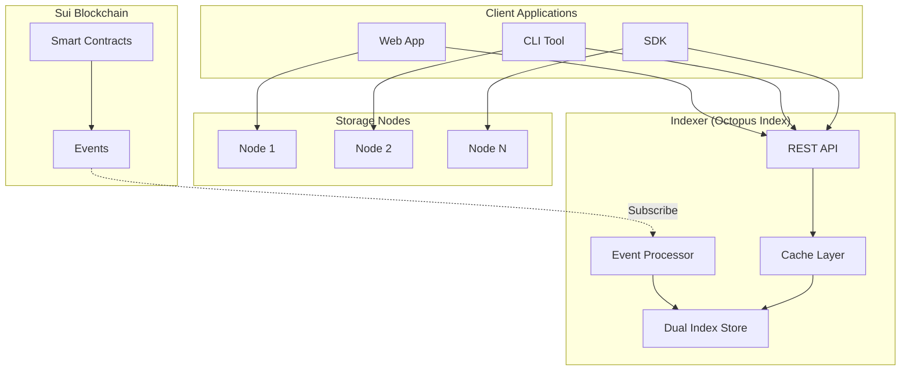
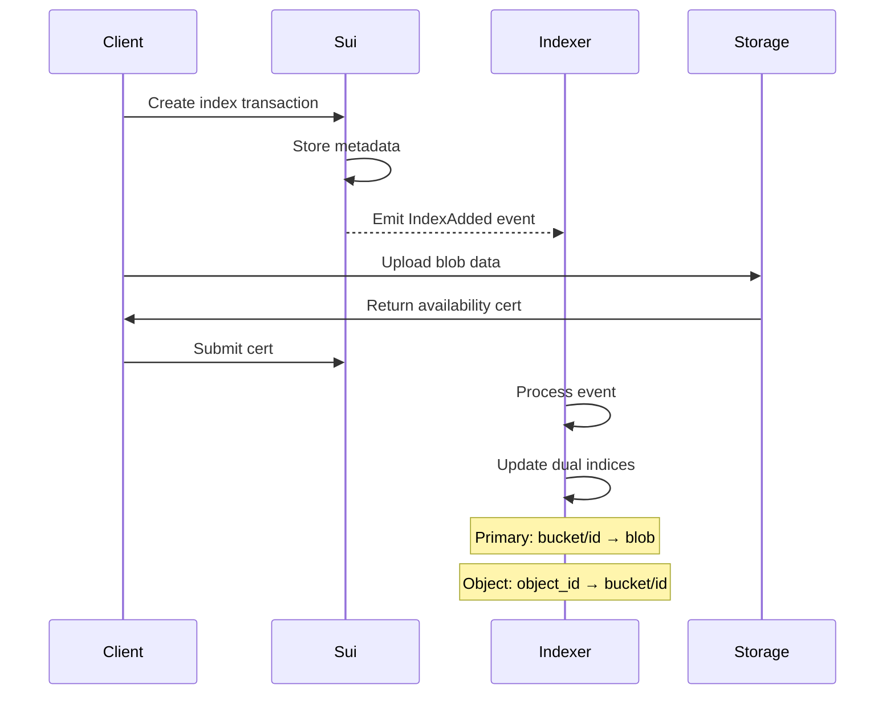
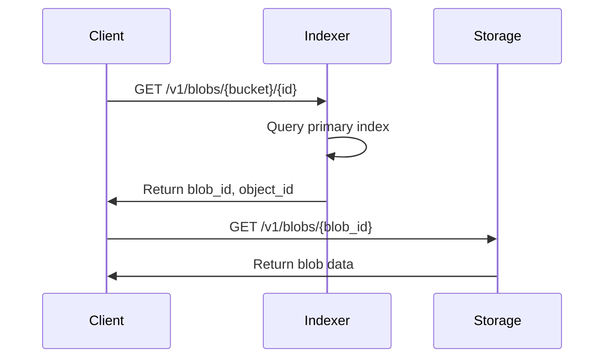
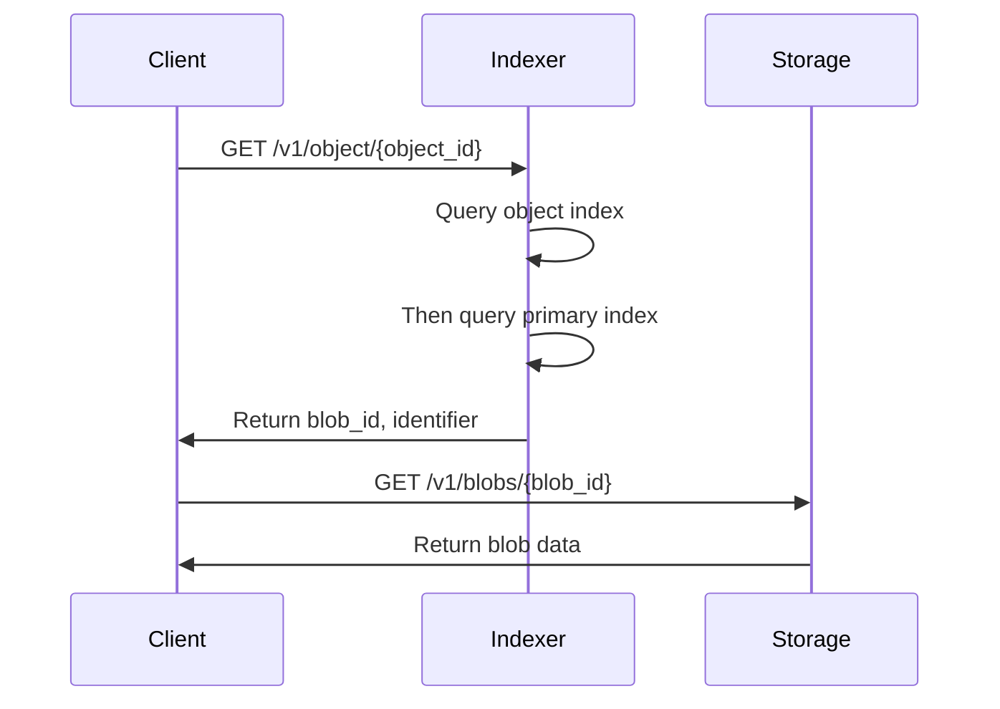
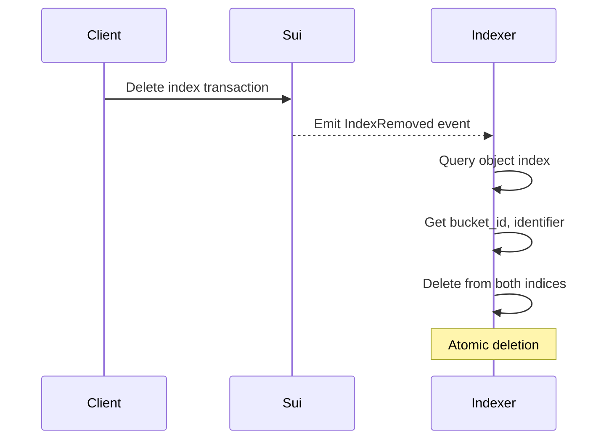

# Walrus Index System Architecture

## System Overview



## Component Details

### 1. Sui Blockchain

**Smart Contracts:**
- Manages buckets and blob metadata
- Emits events for index operations
- Stores resource allocation

**Events Emitted:**
```rust
// Index mutation events
event IndexAdded {
    bucket_id: ObjectID,
    identifier: String,
    object_id: ObjectID,
    blob_id: BlobId,
}

event IndexRemoved {
    object_id: ObjectID,
}
```

**APIs:**
- Transaction submission
- Event subscription
- State queries

---

### 2. Client Applications

**Operations:**
1. Create bucket
2. Store blob with index
3. Read blob by identifier
4. Read blob by object_id
5. Delete blob index

**Client-Side Data Structures:**
```rust
struct BlobRequest {
    bucket_id: ObjectID,
    identifier: String,
    data: Vec<u8>,
}

struct BlobResponse {
    blob_id: BlobId,
    object_id: ObjectID,
    identifier: String,
}
```

**APIs Used:**
- Indexer REST API for discovery
- Storage Node API for blob data
- Sui RPC for transactions

---

### 3. Storage Nodes (Unchanged)

**Responsibilities:**
- Store blob slivers
- Serve blob data
- Generate availability certificates

**APIs:**
- `PUT /v1/store` - Store blob
- `GET /v1/blobs/{blob_id}` - Retrieve blob
- `GET /v1/availability/{blob_id}` - Check availability

---

### 4. Indexer (Octopus Index) - NEW

**Core Data Structures:**

```rust
// Dual Index System
pub struct OctopusIndexStore {
    // Primary: bucket_id/identifier -> BlobIdentity
    primary_index: DBMap<String, PrimaryIndexValue>,
    // Object: object_id -> bucket_id/identifier
    object_index: DBMap<String, ObjectIndexValue>,
}

pub struct BlobIdentity {
    pub blob_id: BlobId,
    pub object_id: ObjectID,
}

pub struct PrimaryIndexValue {
    pub blob_identity: BlobIdentity,
}

pub struct ObjectIndexValue {
    pub bucket_id: ObjectID,
    pub identifier: String,
}

pub enum IndexMutation {
    Insert {
        bucket_id: ObjectID,
        identifier: String,
        object_id: ObjectID,
        blob_id: BlobId,
    },
    Delete {
        object_id: ObjectID,
    },
}
```

**REST API Endpoints:**

| Method | Endpoint | Description |
|--------|----------|-------------|
| GET | `/v1/blobs/{bucket_id}/{identifier}` | Get blob by bucket + identifier |
| GET | `/v1/object/{object_id}` | Get blob by object ID |
| GET | `/v1/bucket/{bucket_id}` | List all blobs in bucket |
| GET | `/v1/bucket/{bucket_id}/{prefix}` | List blobs with prefix |
| GET | `/v1/bucket/{bucket_id}/stats` | Get bucket statistics |
| GET | `/v1/health` | Health check |

---

## Data Flow Sequences

### 1. Store Blob with Index



### 2. Read Blob by Identifier



### 3. Read Blob by Object ID



### 4. Delete Index Entry



---

## Key Design Decisions

### Dual Index System

**Primary Index:**
- Key: `{bucket_id}/{identifier}`
- Value: `BlobIdentity{blob_id, object_id}`
- Use case: User knows bucket and path

**Object Index:**
- Key: `{object_id}`
- Value: `{bucket_id, identifier}`
- Use case: User only has object_id

### Atomic Operations

All index mutations use RocksDB batch operations:
```rust
let mut batch = self.primary_index.batch();
batch.insert_batch(&self.primary_index, [(key1, val1)])?;
batch.insert_batch(&self.object_index, [(key2, val2)])?;
batch.write()  // Atomic commit
```

### Event Processing

```rust
IndexerEventProcessor
    ├── Downloads checkpoints
    ├── Filters Walrus events
    ├── Converts to IndexOperations
    └── Applies to OctopusIndexStore
```

### Cache Strategy

- In-memory HashMap for hot entries
- Cleared on complex operations
- Write-through for consistency

---

## Performance Characteristics

| Operation | Complexity | Notes |
|-----------|------------|-------|
| Insert | O(1) | Two index writes |
| Query by identifier | O(1) | Direct primary lookup |
| Query by object_id | O(1) | Two lookups (object→primary) |
| List bucket | O(n) | Prefix scan |
| Delete by object_id | O(1) | Two index deletes |
| Delete bucket | O(n) | Scan + batch delete |

---

## Storage Layout

```
RocksDB
├── octopus_index_primary/
│   ├── {bucket1}/{path1} → BlobIdentity
│   ├── {bucket1}/{path2} → BlobIdentity
│   └── {bucket2}/{path3} → BlobIdentity
│
└── octopus_index_object/
    ├── {object_id1} → {bucket1, path1}
    ├── {object_id2} → {bucket1, path2}
    └── {object_id3} → {bucket2, path3}
```

---

## Integration Points

1. **Sui Events → Indexer**: Real-time event subscription
2. **Client → Indexer**: REST API for discovery
3. **Client → Storage**: Direct blob retrieval
4. **Indexer → RocksDB**: Persistent dual indices

---

## Future Enhancements

1. **Secondary Indices**: Add custom indices per bucket
2. **Pagination**: Implement cursor-based pagination
3. **Caching**: Add Redis for distributed cache
4. **Sharding**: Horizontal scaling for large deployments
5. **Analytics**: Query patterns and usage metrics