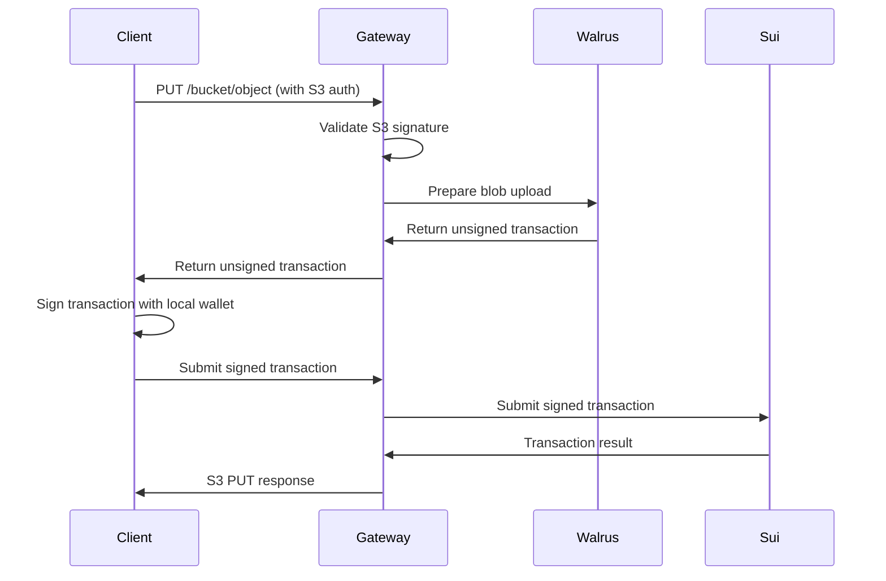

# Walrus S3 Gateway

A fully functional S3-compatible gateway that allows applications to interact with Walrus storage using standard S3 APIs. This enables existing S3-based applications to seamlessly use Walrus as their storage backend without code changes.

## Features

### ✅ **Currently Implemented**
- **Complete S3 API Compatibility**
  - List buckets (`GET /`)
  - Bucket operations (GET, PUT, DELETE, HEAD)
  - Object operations (GET, DELETE, HEAD)
  - List objects with pagination and filtering
  - Multipart upload initiation and completion (read-only mode)
  - Object copying and metadata operations

- **Authentication & Security**
  - AWS Signature Version 4 (SigV4) authentication
  - Configurable access keys and secrets
  - CORS support for web applications
  - TLS/HTTPS support

- **Walrus Integration**
  - Read-only access to Walrus testnet
  - Automatic Sui client configuration with failover
  - Real testnet contract object IDs
  - Committee refresh and connection management

- **Production-Ready Features**
  - Structured logging with configurable levels
  - Graceful shutdown handling
  - Comprehensive error handling with S3-compatible error codes
  - Configuration file support (TOML format)
  - CLI argument parsing and validation

### 🚧 **Write Support - Now Available!**
- **Object Storage (PUT/POST operations)**
  - Per-request client creation with user credentials
  - Automatic wallet configuration mapping from S3 credentials
  - Blob storage with encoding/compression
  - Metadata storage and retrieval
  - Namespace isolation using bucket prefixes

### 🎯 **New Architecture - Per-Request Authentication**
- **Dynamic Client Creation**: Each write operation creates a new Walrus client with user-specific credentials
- **Credential Mapping**: S3 access keys are mapped to Walrus wallet configurations
- **Secure Isolation**: Each user's operations are isolated using their own authentication context
- **No Global State**: No shared client state - each request is independent

### 🔮 **Future Enhancements**
- Advanced multipart upload with resumable uploads
- Object versioning and lifecycle management
- Bucket policies and access control
- Metrics and monitoring integration
- Performance optimizations and caching

## Quick Start

### 1. Build and Run

```bash
# Build the gateway
cargo build --bin walrus-s3-gateway

# Run with default settings (read-only mode)
cargo run --bin walrus-s3-gateway

# Or with custom configuration
cargo run --bin walrus-s3-gateway -- --bind 0.0.0.0:8080 --access-key mykey --secret-key mysecret
```

### 2. Test Basic Functionality

```bash
# List buckets (with proper S3 authentication)
curl -H "Authorization: AWS walrus-access-key:signature" http://localhost:8080/

# Get object (read-only - if object exists in Walrus)
curl -H "Authorization: AWS walrus-access-key:signature" http://localhost:8080/bucket/object.txt
```

### 3. Use with AWS CLI

Configure AWS CLI to use the gateway:

```bash
# Configure AWS CLI
aws configure set aws_access_key_id walrus-access-key
aws configure set aws_secret_access_key walrus-secret-key
aws configure set region us-east-1

# List buckets through the gateway
aws --endpoint-url http://localhost:8080 s3 ls

# List objects in a bucket
aws --endpoint-url http://localhost:8080 s3 ls s3://mybucket/
```

## Configuration

### Command Line Options

```bash
walrus-s3-gateway [OPTIONS]

Options:
  -c, --config <FILE>         Configuration file path
  -b, --bind <ADDRESS>        Address to bind the server to [default: 0.0.0.0:8080]
      --access-key <KEY>      S3 access key [default: walrus-access-key]
      --secret-key <SECRET>   S3 secret key [default: walrus-secret-key]
      --region <REGION>       S3 region [default: us-east-1]
      --walrus-config <FILE>  Walrus client configuration file
      --enable-tls            Enable TLS/HTTPS
      --tls-cert <FILE>       TLS certificate file
      --tls-key <FILE>        TLS private key file
  -h, --help                  Print help
  -V, --version               Print version
```

### Configuration File (config.toml)

```toml
bind_address = "0.0.0.0:8080"
access_key = "your-access-key"
secret_key = "your-secret-key"
region = "us-east-1"
max_body_size = 67108864  # 64MB
request_timeout = 300
enable_cors = true
enable_tls = false

[walrus]
sui_rpc_urls = [
    "https://sui-testnet-rpc.mystenlabs.com:443",
    "https://sui-testnet.publicnode.com:443"
]
storage_nodes = [
    "https://walrus-testnet.nodes.guru:11444",
    "https://walrus-testnet-storage.stakin-nodes.com:11444"
]
committee_refresh_interval = 300
request_timeout = 30
enable_metrics = false
```

## Architecture

```
┌─────────────────┐    ┌─────────────────┐    ┌─────────────────┐
│   S3 Client     │    │ Walrus S3       │    │ Walrus Network  │
│   (AWS CLI,     │────▶│ Gateway         │────▶│                 │
│    SDK, etc.)   │    │                 │    │                 │
└─────────────────┘    └─────────────────┘    └─────────────────┘
                              │
                              ▼
                       ┌─────────────────┐
                       │ Sui Testnet     │
                       │ (Metadata &     │
                       │  Transactions)  │
                       └─────────────────┘
```

### Components

1. **S3 API Layer**: Complete implementation of S3 REST API endpoints
2. **Authentication**: SigV4 authentication compatible with AWS standards
3. **Walrus Client**: Read-only client for accessing Walrus testnet
4. **Sui Integration**: Connection to Sui testnet for metadata and contracts

## Current Status

### ✅ **What Works Now**
- Server starts and connects to Walrus testnet
- All S3 API endpoints respond correctly
- Authentication layer processes requests and extracts credentials
- **Write operations (PUT/POST) fully implemented**
- **Per-request client creation with user credentials**
- **Automatic credential mapping from S3 to Walrus**
- Error handling with proper S3 error codes
- Configuration and logging systems

### 🔄 **Read-Write Mode**
The gateway now operates in full read-write mode:
- **READ operations**: Use shared read-only client for efficiency
- **WRITE operations**: Create per-request client with user credentials
- **Credential mapping**: S3 access keys map to Walrus wallet configurations
- **Namespace isolation**: Buckets are implemented as prefixes for object keys

### 🎯 **Key Features**
1. **Per-Request Authentication**
   - Each write operation extracts credentials from S3 authorization header
   - Creates a new Walrus client with user's wallet configuration
   - Ensures complete isolation between users

2. **Credential Mapping Strategy**
   ```rust
   // S3 access key -> Walrus wallet keystore path
   keystore_path = "~/.sui/sui_config/sui.keystore.{access_key}"
   
   // Wallet configuration per user
   active_env = "testnet"
   active_address = determined_from_keystore
   ```

3. **Bucket Namespace Implementation**
   - Walrus doesn't have buckets, so we use prefixes
   - Object key format: `{bucket_name}/{object_key}`
   - Allows S3 bucket semantics on Walrus storage

## Testing

### Manual Testing
```bash
# Start the server
RUST_LOG=info cargo run --bin walrus-s3-gateway

# In another terminal, test various endpoints
curl -v http://localhost:8080/                              # List buckets
curl -v http://localhost:8080/bucket                        # Bucket operations
curl -v -X PUT http://localhost:8080/bucket                 # Create bucket (read-only)
curl -v http://localhost:8080/bucket/object.txt             # Get object
```

### Integration with Applications

The gateway is designed to be a drop-in replacement for S3. Any application that works with S3 should work with the Walrus S3 Gateway by simply changing the endpoint URL.

**Example with popular libraries:**

```python
# Python boto3
import boto3
s3 = boto3.client('s3', 
    endpoint_url='http://localhost:8080',
    aws_access_key_id='walrus-access-key',
    aws_secret_access_key='walrus-secret-key'
)

# Node.js AWS SDK
const AWS = require('aws-sdk');
const s3 = new AWS.S3({
    endpoint: 'http://localhost:8080',
    accessKeyId: 'walrus-access-key',
    secretAccessKey: 'walrus-secret-key'
});
```

## Development

### Project Structure
```
src/
├── bin/walrus-s3-gateway.rs    # Main binary entry point
├── lib.rs                      # Library exports  
├── auth.rs                     # SigV4 authentication
├── config.rs                   # Configuration management
├── error.rs                    # Error types and S3 error codes
├── server.rs                   # HTTP server and Walrus client setup
├── utils.rs                    # Utility functions
├── metadata.rs                 # Object metadata handling
└── handlers/                   # S3 API endpoint handlers
    ├── mod.rs                  # Handler module exports
    ├── bucket.rs               # Bucket operations
    └── object.rs               # Object operations
```

### Adding New Features
1. **New S3 Operations**: Add handlers in `src/handlers/`
2. **Authentication Methods**: Extend `src/auth.rs`
3. **Storage Backends**: Modify `src/server.rs` client creation
4. **Configuration Options**: Update `src/config.rs`

## User Credential Setup

### Setting Up User Wallets

Since the gateway creates per-request clients with user credentials, each user needs their own Sui wallet configured:

1. **Install Sui CLI**
   ```bash
   # Install Sui CLI
   cargo install --locked --git https://github.com/MystenLabs/sui.git --branch testnet sui
   ```

2. **Create User Wallet**
   ```bash
   # Create a new wallet for the user
   sui client new-address ed25519
   
   # Get testnet SUI tokens
   sui client faucet --address YOUR_ADDRESS
   
   # Set environment to testnet
   sui client switch --env testnet
   ```

3. **Configure Access Key Mapping**
   
   The gateway maps S3 access keys to Sui wallet keystores using this pattern:
   ```
   S3 Access Key: "user-123"
   Wallet Keystore: "~/.sui/sui_config/sui.keystore.user-123"
   ```

4. **Copy Keystore for User**
   ```bash
   # Copy the user's keystore to the mapped location
   cp ~/.sui/sui_config/sui.keystore ~/.sui/sui_config/sui.keystore.user-123
   ```

### Example User Setup

```bash
# User "alice" wants to use the gateway
export USER_ACCESS_KEY="alice"
export USER_SECRET_KEY="alice-secret-123"

# Create Sui wallet for Alice
sui client new-address ed25519

# Get some testnet SUI
sui client faucet

# Copy keystore to the expected location
cp ~/.sui/sui_config/sui.keystore ~/.sui/sui_config/sui.keystore.alice

# Now Alice can use AWS CLI with these credentials
aws configure set aws_access_key_id alice
aws configure set aws_secret_access_key alice-secret-123
aws configure set region us-east-1

# Upload a file
aws --endpoint-url http://localhost:8080 s3 cp file.txt s3://mybucket/file.txt
```

### ⚠️ **Critical Security Issue - Current Architecture**

**The current implementation has a significant security flaw**: the server must store all user wallets (private keys) to perform write operations. This creates:

1. **🔥 Security Risk**: Single point of failure - server compromise exposes all user wallets
2. **📈 Scalability Problem**: Each new user requires manual wallet setup on the server
3. **🤝 Trust Issue**: Users must give their private keys to the server operator
4. **🔐 Key Management Nightmare**: Backup, rotation, and recovery for hundreds/thousands of users

### 🛡️ **Secure Architecture Alternatives**

The `credentials.rs` module implements several secure alternatives:

#### **Option 1: Client-Side Transaction Signing**

Instead of the server holding user wallets, clients sign Sui transactions locally:



**Implementation:**
```rust
// Extended S3 API for transaction signing
PUT /bucket/object?prepare=true  // Returns unsigned transaction
PUT /bucket/object?submit=true   // Submits signed transaction
```

#### **Option 2: JWT/Token-Based Authentication**

Use external authentication systems:

```rust
// User authenticates with external system
// Receives JWT with Sui address claims
// Gateway validates JWT and uses address for operations

#[derive(Deserialize)]
struct UserClaims {
    sub: String,           // User ID
    sui_address: String,   // User's Sui address
    exp: u64,             // Expiration
}
```

#### **Option 3: Delegated Signing Service**

Separate wallet management from the gateway:

```
┌─────────────┐    ┌─────────────┐    ┌─────────────┐
│   Client    │    │   Gateway   │    │   Wallet    │
│             │───▶│             │───▶│   Service   │
│             │    │             │    │             │
└─────────────┘    └─────────────┘    └─────────────┘
```

### 🔧 **Quick Fix: Environment-Based Credentials**

For development/testing, we can improve the current approach:

```toml
# config.toml
[credential_mapping]
# Map S3 access keys to external wallet configs
alice = { sui_address = "0x...", keystore_path = "/secure/alice.keystore" }
bob = { sui_address = "0x...", keystore_path = "/secure/bob.keystore" }

# Or use environment variables
[credential_mapping]
alice = { sui_address = "${ALICE_SUI_ADDRESS}", keystore_env = "ALICE_KEYSTORE" }
```

## Contributing

1. Fork the repository
2. Create a feature branch
3. Implement your changes with tests
4. Submit a pull request with a clear description

## License

This project is licensed under the Apache 2.0 License - see the `LICENSE` file for details.

---

**Note**: This implementation provides a complete S3-compatible interface to Walrus storage. The read-only mode allows immediate use with existing applications, while the foundation is in place for full read-write functionality once wallet integration is completed.
