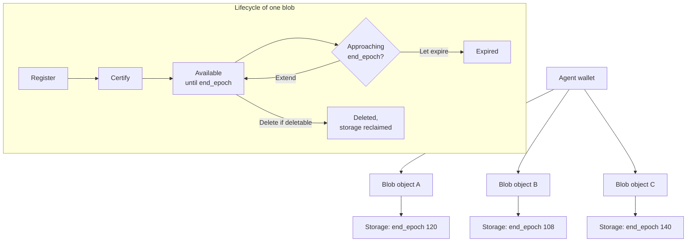

<AgentPrompt
  prompt="My agent stores blobs on Walrus in a loop. Show me how to track what it owns over time: the object model, how to list its blobs, and how to renew them before they expire."
/>

An autonomous agent that stores data on Walrus needs to keep track of what it
owns, where each item lives, and when each item expires. Unlike a single upload
you do by hand, an agent accumulates blobs continuously, so it needs a durable,
queryable record of its storage rather than a memory of individual uploads. This
page explains the object model behind agent-owned data and shows how an agent
tracks and renews that data over its lifetime.

For the decision of what to store where, see
[Where to store AI agent data](/docs/ai-agents/where-to-store-agent-data).

## The object model

When an agent stores data on Walrus, two onchain objects on Sui represent it, and
the agent's wallet owns both.

- A **`Storage`** object reserves storage space for a period. It records a
  `start_epoch`, an `end_epoch`, and a `storage_size`. The reservation is
  inclusive of the start epoch and exclusive of the end epoch.
- A **`Blob`** object represents the stored blob itself. It records the
  `blob_id` (the content-derived identifier), the `size`, the `registered_epoch`,
  the `certified_epoch` once the blob is certified, and a `deletable` flag. Every
  `Blob` object wraps a `Storage` object that backs it.

Because the agent's wallet owns these objects, the data is portable and the agent
controls its lifetime. The blob ID is derived from the content, so the same bytes
always produce the same ID, and a read returns exactly those bytes or fails. See
[Core concepts](/docs/system-overview/core-concepts) for the full data model.

## How an agent's storage evolves over time

The diagram below shows an agent's wallet owning several blobs, each wrapping its
own storage reservation, and the lifecycle each blob moves through as time
advances by epoch.



Each blob advances independently. Blob B in the diagram reaches its end epoch
first, so the agent must extend it before the current epoch catches up, or accept
that it expires. Tracking is what tells the agent which blob needs attention and
when.

## Recording what the agent stores

Every time the agent stores a blob, capture two identifiers and keep them:

- The **blob ID**, the content-derived identifier used to read the data back.
- The **Sui object ID** of the `Blob` object, used to extend, delete, or inspect
  the blob's lifetime.

The blob ID is what you read with; the object ID is what you manage the lifetime
with. An agent that keeps only one of the two cannot both retrieve and renew its
data, so record both. Store this record durably, alongside enough context for the
agent to know what each blob holds and why it kept it.

## Querying the blobs an agent owns

The agent's wallet is the source of truth for what it owns. Rather than trusting
an in-memory list alone, an agent can reconcile against Sui by listing the `Blob`
objects owned by its address and reading each object's fields, including the
wrapped storage's `end_epoch`. Reading the object model directly means the agent's
view stays correct even after a restart.

To check a single blob's status and remaining lifetime with the client:

```sh
$ walrus blob-status --blob-id <BLOB_ID>
```

For a programmatic check of the object fields and a TypeScript example, see
[Verify blob availability before acting](/docs/walrus-client/verifying-availability).

## Managing lifetimes before expiry

A blob expires at the beginning of its end epoch, and you can extend a blob only
while it is still live. An agent that stores long-term memory therefore has to
watch end epochs and renew on time.

1. Read the current epoch with `walrus info`.
2. For each tracked blob, compare the current epoch against the blob's
   `end_epoch`.
3. Extend any blob that is approaching its end epoch, using the object ID:

```sh
$ walrus extend --blob-obj-id <BLOB_OBJECT_ID>
```

Choose permanence at store time based on how long the data must live. A deletable
blob can be deleted before expiry to reclaim its storage, while a permanent blob
cannot. For the full set of lifecycle commands, see
[Managing blobs](/docs/walrus-client/managing-blobs), and for how lifetime and
size drive cost, see [Storage costs](/docs/system-overview/storage-costs).

:::tip

Have the agent check end epochs on a schedule rather than waiting for a read to
fail. Looking well before the end epoch leaves time to extend and avoids surprise
expiry of the agent's memory.

:::

## Keeping a manifest for retrieval

An agent scales past a handful of blobs by keeping a **manifest**: a durable
record that maps each stored item to its blob ID, object ID, end epoch, and a
short description of the content. The manifest is what turns a pile of blobs into
a queryable memory.

Two features make the manifest richer:

- **Attributes.** Attach key-value attributes to a blob's object so the metadata
  travels with the blob. Set them with `walrus set-blob-attribute` and read them
  with `walrus get-blob-attribute`, as described in
  [Managing blobs](/docs/walrus-client/managing-blobs).
- **Quilt tags.** When batching many small memory items, store them in a
  [Quilt](/docs/system-overview/quilt) and tag each item, so the agent can look up
  items by tag rather than scanning everything.

## Next steps

- Review the memory concepts in
  [How AI agent memory works](/docs/ai-agents/agent-memory).
- Manage the full blob lifecycle in
  [Managing blobs](/docs/walrus-client/managing-blobs).
- Batch and tag many small items with
  [Batch storage with Quilt](/docs/system-overview/quilt).
