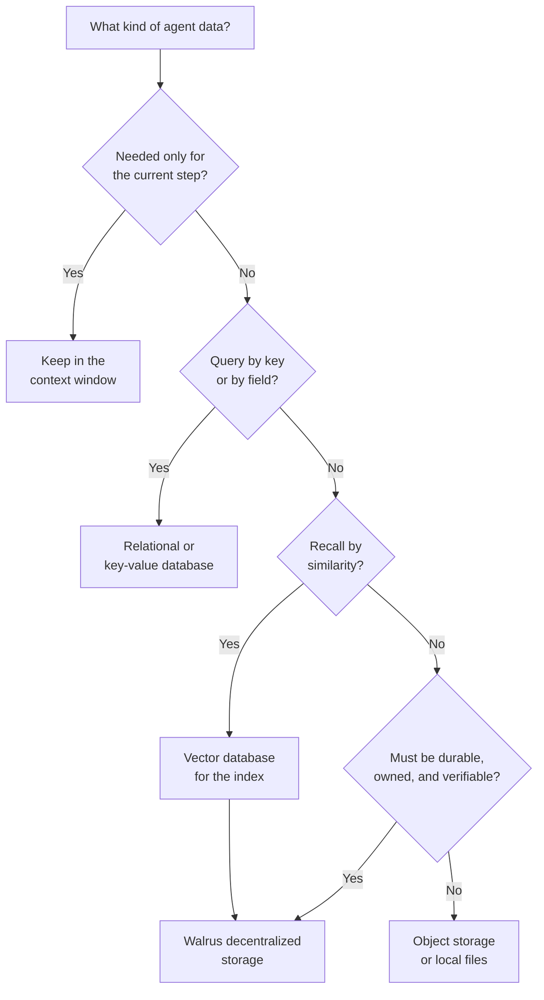

<AgentPrompt
  prompt="My autonomous agent produces conversation history, learned facts, embeddings, and generated files. Help me decide where each of these should live, and when decentralized storage is a better fit than S3 or a database."
/>

An autonomous AI agent produces several distinct kinds of data, and no single
store is the right home for all of them. The question "where should I store AI
agent data?" is really several questions, one for each kind of data the agent
creates. This guide sorts agent data into categories, compares the storage
options against the properties that matter, and gives you a decision path for
picking a layer.

For the concepts behind the data an agent keeps, see
[How AI agent memory works](/docs/ai-agents/agent-memory).

## What data an agent produces

Before choosing a store, name what you are storing. Most agents produce four
kinds of data:

- **Active task state:** the goal, plan, and intermediate results for the step
  the agent is on right now. Small, hot, and short-lived.
- **Structured state:** accounts, jobs, configuration, and relationships the
  agent queries by key or by field. Needs transactions and lookups.
- **Memory items:** conversation history, learned facts, and summaries the agent
  recalls later, usually by similarity to the current task.
- **Artifacts:** the files and outputs the agent generates, such as documents,
  images, datasets, and checkpoints. Often large and worth keeping verifiably.

## The storage options

The realistic options for agent data fall into six layers:

- **In-context memory:** data held in the model's context window. Immediate but
  temporary and bounded.
- **Local files:** the agent's own disk. Simple, but tied to one machine and lost
  when that machine goes away.
- **Relational or key-value databases:** structured stores for state you query by
  key or field.
- **Vector databases:** stores that index embeddings and retrieve by similarity,
  the workhorse for semantic recall.
- **Object storage:** provider-hosted blob stores such as S3 for large artifacts.
- **Decentralized storage:** protocols such as [Walrus](/docs/system-overview/index)
  that keep data available across a network with content-addressed, verifiable
  reads and user-owned data.

## Comparison

The layers differ most on durability, verifiability, ownership, and cost model.
The table below compares them for agent workloads.

| Storage layer            | Durability            | Verifiable reads | Data ownership        | Best for                          |
| ------------------------ | --------------------- | ---------------- | --------------------- | --------------------------------- |
| In-context memory        | None (ephemeral)      | Not applicable   | Not applicable        | The current reasoning step        |
| Local files              | Single machine        | No               | You, on one host      | Scratch data and caches           |
| Relational / KV database | High, provider-run    | No               | Provider account      | Structured state and lookups      |
| Vector database          | High, provider-run    | No               | Provider account      | Similarity search over embeddings |
| Object storage (S3)      | High, provider-run    | Weak (trust host)| Provider account      | Large artifacts, provider-locked  |
| Decentralized (Walrus)   | High, network-wide    | Yes (content ID) | You, portable onchain | Durable canonical memory, artifacts |

Two columns deserve emphasis for agents that run unattended:

- **Verifiable reads.** On Walrus, every blob has a
  [content-derived ID](/docs/system-overview/core-concepts#content-addressing-and-versioning),
  so a read returns exactly the bytes that were written or fails. An agent does
  not have to trust a host to serve back unaltered data.
- **Data ownership.** Walrus data is represented by onchain objects the agent's
  wallet owns, so the data is portable and not locked to one provider's account.

## A decision path

Pick the layer by the job the data does, not by habit. The following decision
tree walks from the kind of data to the layer that fits.

Notice that the similarity path still ends at durable storage. A vector database
answers "which items are relevant?" but the vector index holds embeddings and
pointers, not the authoritative content. The canonical bytes belong in a durable
store so that a lost or rebuilt index never means lost memory.

## The best vector database for AI agents is a pairing

Teams often ask which vector database is best for AI agents. The more useful
framing is that a vector database is one half of a pair, not the whole storage
story. The vector database indexes embeddings for fast similarity search; a
durable store holds the canonical memory items and artifacts those embeddings
point to. Any capable vector database works in this pattern, so choose the one
that fits your latency and operational needs, and back it with durable storage
for the source of truth.

Walrus fills the durable half well for agent workloads:

- Memory items and artifacts are stored as blobs with content-derived IDs, giving
  verifiable reads.
- Blobs live for a storage period the agent controls and can extend, so long-term
  memory does not silently expire. See
  [Storage costs and lifetimes](/docs/system-overview/storage-costs).
- Many small memory items can be batched with
  [Quilt](/docs/system-overview/quilt) to lower per-item cost, and tagged for
  retrieval.
- The agent owns the onchain objects for its data. See
  [Tracking agent-owned blobs and storage](/docs/ai-agents/tracking-agent-blobs).

## When to choose decentralized storage over object storage

Reach for Walrus over provider object storage when one or more of these hold:

- The agent must **own** its data and keep it portable rather than locked to a
  single provider account.
- Reads must be **verifiable**, so the agent can prove it read back the exact
  bytes it stored.
- Data must stay **available** without depending on one company's uptime or
  billing relationship.
- The data has value to more than the agent that wrote it, such as published
  datasets or shared artifacts.

When none of these apply and the data is disposable scratch, local files or
provider object storage are simpler and cheaper.

## Next steps

- Understand the memory concepts first in
  [How AI agent memory works](/docs/ai-agents/agent-memory).
- Model and track an agent's stored data in
  [Tracking agent-owned blobs and storage](/docs/ai-agents/tracking-agent-blobs).
- Start writing data with the client in
  [Storing blobs](/docs/walrus-client/storing-blobs).
