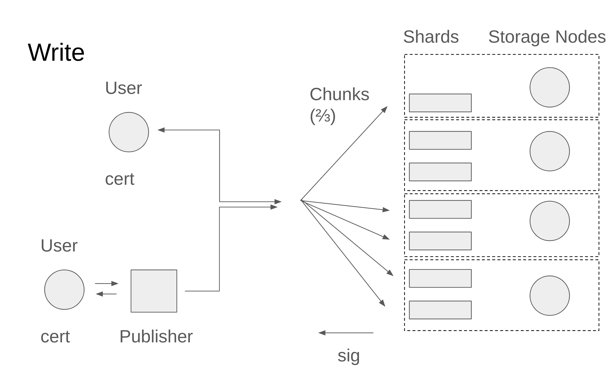
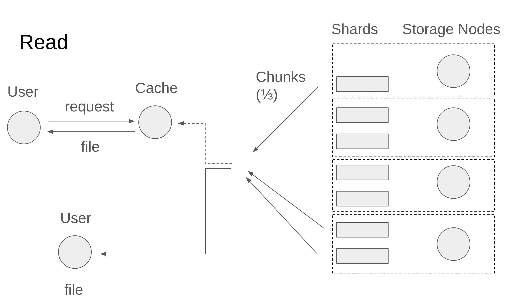

# Walrus Architecture Overview

## Walrus Objectives

This document presents the architecture of Walrus, a decentralised store and availability layer for blobs, namely larger (>100Kb) binary files with unstructured content.

Walrus supports operations to store and retrieve blobs, as well as to verify their availability.
It ensures content survives storage nodes suffering Byzantine faults and remains available and retrievable. It provides APIs to access the stored content over a CLI, SDKs and over web2 HTTP technologies.
Under the hood, storage cost is a small fixed multiple of the size of blobs (around 5x) thanks to advance error correction coding, in contrast to the full replication (100x) of data stored in Sui objects.
As a result much bigger resources may be stored on Walrus at lower cost compared to Sui.
Walrus uses the Sui chain for coordination and payments. Only meta-data is stored on Sui or its history.

We discuss in some details operations relating to storage, retrieval and availability. We plan to include in Walrus some minimal governance to allow storage nodes to change between storage epochs.
Walrus is also compatible with periodic payments for continued storage. In the future we plan some storage attestation based on challenges to (somewhat) ensure that blobs are stored or at least available. Walrus also allows light-nodes that store small parts of blobs to get rewards for proving availability and assisting recovery.

There are a few things that Walrus explicitely is not.
Walrus does not reimplement a Content Distribution Network (CDN) that might be geo-replicated or with a 10s of ms latency. Traditional CDN should be usable and compatible with Walrus caches.
Walrus does not re-implement a full smart contracts platform with consensus or execution. It relies on Sui smart contracts when necessary, to manage Walrus processes including payments, storage epochs etc.
Walrus supports storage of any blob including encrypted blobs, however Walrus itself is not the distributed key management infrastructure that manages and distributed encryption or decryption keys to support a full private storage eco-system. It should however be compatible with such infrastructures.

## Use-cases

App builders can use Walrus in conjunction with Sui to build experiences that require more data to be stored:

- **Storage of media for NFT or dapps**: Walrus can directly store and serve media such as images, sounds, sprites, videos, other game assets, etc. This is publicly available media that can be accessed using HTTP requests at caches to create multimedia dapps.
- **AI related use cases**: Walrus can store clean data sets of training data, datasets with a known and verified provenance, models weights, and proofs of correct training for AI models. Or ensuring the availability of an AI model output.
- **Storage of long term archival of blockchain history**: Walrus can be used as a lower cost decentralized store to store blockchain history. For Sui this can include sequences of checkpoints with all associated transaction and effects content. As well as historical snapshots of the state, or code.
- **Support availability for L2s**: Walrus allows parties to certify the availability of blobs, as required by L2s that need data to be stored and be attested as available to all. This may also include availability of audit data such as validity proofs, zero knowledge proofs of correct execution or large fraud proofs.
- **Support full block sites experience**: Walrus can host full decentralized web experiences including all resources (such as js, css, html, media). These can provide content but also host the UX of dapps.
- **Support subscription models for media.** Creators can store encrypted media on Walrus and only provide access via decryption keys to parties that have paid a subscription fee or have paid for contents. (Note that Walrus provides the storage).

## Basic architecture and security assumptions

The key actors in the Walrus architecture are:

- **Users** through **clients** want to store and read **blobs**. They are ready to pay for service when it comes to writes, and when it comes to non-best-effort reads. Users also want to prove the **availability** of a blob to third parties without the cost of sending the full blob. Users may be malicious in various ways: they may wish to not pay for services, prove the availability of an unavailable blobs, or modify / delete blobs without authorization, try to exhaust resources of storage nodes, etc.
- **Storage nodes** hold one or many **Shards** with a **storage epoch**. Each blob is erasure encoded in many **slivers** and **slivers from** each stored Blob become part of shards. A shard at any storage epoch is associated with a **storage node** that actually stores all slivers of the shard, and is ready to serve them. The assignment of storage nodes to shards within **storage epochs** is controlled by governance and we assume that 2/3 of the shards are managed by correct storage nodes within each storage epoch. This means that we must tolerate up to 1/3 Byzantine storage nodes within each storage epoch and across storage epochs.
- All clients and storage nodes operate a **blockchain** client (Sui), and mediate payments, resources (space), mapping of shards to storage nodes, and meta-data through blockchain smart contracts.

Walrus supports any additional number of optional infrastructure actors that can operate in a permissionless way:

- **Caches** are **clients** that store one or more full blobs and make them available to users over traditional web2 (HTTP, etc) technologies. They are optional in that end-users may also operate a local cache, and perform Walrus reads over web2 technologies locally. However, cache infrastructures may also act as CDNs, share the cost of blob reconstruction over many requests, have better connectivity, etc.
- **Publishers** are **clients** that help end-users that wish to store a blob store it using web2 technologies, and using less bandwidth and custom logic. They in effect receive the blob to be published, and perform the store protocol on their behalf, including the encoding, distribution of slivers to shards, creation of certificate of certificate, and other on-chain actions. They are optional in that a user may directly interact with both Sui and storage nodes to store blobs directly.

Neither caches, publishers or end-users are trusted components of the system, and they may deviate from the protocol arbitrarily. However, some of the security properties of Walrus only hold for honest end-users that use honest intermediaries (caches and publishers). We provide enough means for end-users to audit the correct operation of both caches and publishers, but such audits may be too expensive to perform constantly (particularly when intermediaries are used to get a web2 experience).

## Assurance Properties of Walrus

The properties below hold subject to the assumption that for all storage epochs 2/3 of shards are operated by storage nodes that faithfully and correctly follow the Walrus protocol.

Each blob is encoded using error correction into slivers and a **Blob ID** is cryptographically derived. For a given Blob ID there is a **point of availability** (PoA) and an **availability period**, when availability is attested on the Sui chain. The following properties relate to the PoA:

- After the PoA for a Blob ID any correct user performs a read within the availability period will eventually terminate and get a value V which is either blob contents F or None.
- After PoA if two correct users perform a read and get V and V’ then V = V’.
- A correct user with an appropriate storage resource can always perform store for a blob F with a Blob ID to the PoA.
- A read after PoA for a blob F stored by a correct user, will result in F.

Some assurance properties relate to the storage nodes holding shards in Walrus. An **inconsistency proof** proves that a Blob ID was stored by an incorrect user.

- After PoA and for a Blob ID stored by a correct user, a storage node is always able to recover the correct sliver this Blob ID.
- After PoA if a correct storage node cannot recover a sliver, it can produce an inconsistency proof for the Blob ID.
- If a BlobID is stored by a correct user, an inconsistently proof cannot be derived for it.
- A read by a correct user for a Blob ID for which an inconsistency proof may exist returns None.

Note that there is no delete operation and a Blob ID past PoA will be available for the full availability period.

As a rule of thumb: before PoA it is the responsibility of a client to ensure the availability of a Blob and its upload to Walrus. After PoA it is the responsibility of Walrus as a system to maintain the availability of the Blob ID as part of its operation for the full availability period remaining.

## Encoding, overheads, and verification

We summarize here the basic encoding and cryptographic techniques used in Walrus.

- **Storage nodes** hold one or many **shards** in a storage epoch, out of a larger total (say 1K) and each shard contains one blob **sliver** for each blob past PoA. Each shard is assigned to a storage node in a storage epoch.
- An [erasure code](https://en.wikipedia.org/wiki/Online_codes) **encode algorithm** takes a blob, and encodes it as $K$ symbols, such that any fraction $p$ of symbols can be used to reconstruct the blob. Each blob sliver contains a fixed number of such symbols. We select $p<1/3$ so that a third of symbols and also slivers may be used to reconstruct the blob by the **decode algorithm**. The matrix used to produce the erasure code is fixed and the same for all blobs by the Walrus system, and encoders have no discretion about it.
- Storage nodes will manage one or more shards, and corresponding sliver of each blob are distributed to all the storage shards. As a result, the overhead of the distributed store is ~5x that of the blob itself, no matter how many shards we have.

Each blob is also associated with some meta-data, ie a blob ID, to allow verification:

- A blob ID is computed as an authenticator of the set of all shard data and meta-data (byte size, blob hash). For example we hash the sliver in each of the shards and adding the resulting hashes into a Merkle tree or an authenticated skip list or just a blob. Then the root of the Merkle tree or skip list or the hash of the blob is the blob ID that identifies the blob in the system.
- Each storage node may use the blob ID to check if some shard data belongs to a blob using the authenticated structure (Merkle tree, skip list, blob). A successful check means that the data is indeed as intended by the writer of the blob (who, remember, may be corrupt).
- When any party reconstructs a blob ID from shards data and slivers, or accepts any blob purporting to be a specific blob ID, it must check that it encodes to the correct blob ID. This process involves re-coding the blob using the erasure correction code, and re-deriving the blob ID to check the blob indeed matches it. This prevents a malformed blob (ie incorrectly erasure coded) from ever being associated with a blob ID at any correct recipient.
- A set of slivers well above the reconstruction threshold belonging to a blob ID that are either inconsistent or lead to the reconstruction of a different ID represent an incorrect encoding (this may happen if the user that encoded the Blob was malicious and encoded it incorrectly). Storage nodes may delete slivers belonging to inconsistently encoded blobs, and upon request return an inconsistency proof.

# Walrus operations on Sui

Walrus uses Sui smart contracts to coordinate storage operations as resources that have a lifetime, and payments. As well as to facilitate governance operations to determine the storage nodes holding each storage shard. We outline here these operations and refer to them below as part of the read / write paths. As a reminder, only blob meta-data is ever exposed to Sui or its validators, and the content of blobs is always stored off-chain on Walrus storage nodes and caches. The storage nodes or caches do not have to overlap with any Sui infra (validators etc), and the storage epochs may be of different lengths and not have the same start / end times as Sui epochs.

## Storage resource life cycle on Sui

A number of Sui smart contracts hold the meta-data of the Walrus system and all its entities.

- A **Walrus system object** holds the committee of storage nodes for the current storage epoch. The system object also holds the total available space on walrus and the price per byte of storage. These values are determined by 2/3 agreement between the storage nodes for the storage epoch. Users can pay to purchase storage space for some time duration. These space resources may be split, merged and traded as commodities. Later they can be used to place a Blob ID into Walrus.
- The **storage fund** holds funds for storing blobs over one, multiple storage epochs or perpetually. When purchasing storage space from the system object users pay into the storage fund separated over multiple storage epochs, and payments are made each epoch to storage nodes according to performance (see below).
- A user acquires some storage through the contracts or transfer, and can assign to it a Blob ID, signifying they wish to store this Blob ID into it. This emits a Move **resource event** that both caches and storage nodes listen to to expect and authorize off-chain storage operations.
- Eventually a user holds an off-chain **availability certificate** from storage nodes for a Blob ID. The user **uploads the certificate on chain** to signal that the Blob ID is available for an availability period. The certificate is checked against the latest walrus committee, and an **availability event** is emitted for the Blob ID if correct.
- In case a Blob ID is not correctly encoded a **inconsistency proof certificate** may be uploaded on chain at a later time, and an **inconsistent blob event** is emitted signaling to all that the Blob ID read results will always return None. This indicates that its slivers may be deleted by storage nodes, except for an indicator to return None.

## Governance operations on Sui

Each Walrus storage epoch is represented by the Walrus system object that contains a storage committee and various meta data or storage nodes like the mapping between shards and storage nodes, available space and current costs.
User may go to the system object for the period and **buy some storage** amount for one or more storage epochs. At each storage epoch there is a price for storage, and the payment provided becomes part of a **storage fund** for all the storage epochs that span the storage bought. There is a maximum number of storage epochs in the future for which storage can be bought (~2 years). Storage is a resource that can be split and merged, and transferred.

At the end of the storage epoch part of the funds in the **storage fund need to be allocated to storage nodes**. The idea here is for storage nodes to perform light audits of each others, and suggest which nodes are to be paid based on the performance of these audits. Specifically:

- Each storage node challenges others to provide slivers they declared as available (for which an availability event for the current period was emitted in the past), in a manner that makes the sequence of slivers sequential. And expects the challenge to be responded with the data behind the slivers.
- Based on the results of the challenge and the responses, including whether the data was returned at all, and whether it was returned in a timely manner, each storage nodes provides a suggestion to the system smart contract about how much each storage node should get from the rewards.
- All suggestions are weighted by shards managed and the median or other robust measure is used to actually distribute payments from the storage fund to storage nodes.

# Walrus operations

Walrus operations happen off Sui, but may interact with the Sui flows defining the resource life cycle.

## Write paths

Systems overview of writes, illustrated above:

- A user acquires a storage resource of appropriate size and duration on-chain, either by directly buying it on the walrus system contract, or a secondary market. A user can split, merge, and transfer storage resources allowing them to operate as commodities.
- When a user wants to write a blob, it first erasure codes it using encode, and computes its blob ID. Then they can perform the following steps itself, or use a publisher to perform steps on their behalf.
- The user goes on chain (Sui) and updates a storage resource to associate it to the Blob ID with the appropriate size and lifetime desired. This emits an event, received by storage nodes. Once the user receives it then continue the upload.
- The user also sends each of the blob slivers and meta-data to the storage node that currently manages the corresponding shard.
- A storage node managing a shard receives a sliver and checks it against the Blob ID of the overall blob. It also checks that there is a Blob resource with that blob ID that is authorized to store a blob. If correct, then it signs a statement that it holds the sliver for Blob ID (and meta-data) and returns it to the user.
- The user puts together the signatures returned from storage nodes into an availability certificate and sends it on chain. When successfully checked an availability event for the Blob ID is emitted, and all other storage nodes seek to download any missing shards for the Blob ID. This event being emitted on Sui is the Point of Availability (PoA) for the Blob ID.

The user waits for 2/3 of shards signatures to return a certificate of availability. The rate of the code is below 1/3 allowing for reconstruction if even 1/3 of shards only return the sliver. Since at most 1/3 of the storage nodes can fail, this ensures reconstruction if a reader requests slivers from all storage nodes that have signed the ID of the blob. Note that the full process can be mediated by a publisher, that receives a Blob and drives the process to completion.

### Refresh availability

Since no content data is required to refresh the period of storage we may implement a fully on chain protocols, to request an extension to the availability period of a blob, by providing an appropriate storage resource.

### Inconsistent resource flow

When a correct storage node tries to reconstruct a shard it may fail if the encoding of a Blob ID past PoA was incorrect, and will be able to extract an inconsistency proof for the Blob ID. It then generates a inconsistency certificate and uploads it on chain.

- A storage node fails to reconstruct a shard, and generates an inconsistency proof.
- The storage node sends the Blob ID and inconsistency proof to all storage nodes of the storage epoch, and gets a signature, that it aggregates to an inconsistency certificate.
- The storage node sends the inconsistency certificate to the Walrus smart contract, that checks it and emits a inconsistent resource event.
- Upon receiving a inconsistent resource event correct storage nodes delete sliver data and only keep a meta-data record to return None for the Blob ID for the availability period. No peer challenges are issued for this Blob ID.

Note that a Blob ID that is inconsistent will always resolve to None upon reading: this is due to the read process running the decoding algorithm, and then re-encoding to check the Blob ID is correctly derived from a consistent encoding. This means that an inconsistency proof only reveals a true fact to storage nodes (that may not otherwise have ran decoding), and does not change the output of read in any case.

## Read paths

A user can read stored blobs either directly or through a cache. We discuss here the direct user journey since this is also the operation of the cache in case of a cache miss. We assume that most reads will happen through caches, for blobs that are hot, and will not result in requests to storage nodes.

- The reader sends a request for the shards corresponding to Blob ID to all storage nodes, and waits for f+1 to respond.
- The reader authenticates the slivers returned to with Blob ID, reconstructs the blob, and decides whether it the contents are a Blob or inconsistent.
- Optionally, for a cache, the result is cached and can be served without re-construction for some time, until it is removed from the cache. Requests for the blob to the cache just return the blob contents, or an inconsistency proof or certificate.

### Challenge mechanism for storage attestation

During an epoch a correct storage node challenges all shards to provide Blob slivers past PoA:

- The list of available blobs for the period is determined using the Sui event up to the past period. Either inconsistent blobs or deny list blobs are not challenged, and a record proving this status can be returned instead.
- A challenge sequence is determined by providing a seed to the challenged shard. The sequence is then computed based both on the seed AND the content of each challenged Blob ID. This creates a sequential read dependency.
- The challenge is responded by providing back the sequence of shard contents for the Blob IDs in a timely manner.
- The challenger node uses thresholds to determine whether the challenge was passed, and reports the result on chain.
- The challenge / response communication is authenticated.

Challenges provide some reassurance that the storage node actually can recover shard data in a probabilistic manner, avoiding storage nodes getting payment without any evidence they may retrieve shard data. The sequential nature of the challenge and some reasonable timeout also ensure that the process is somewhat efficient.

## Future discussion

We leave off this document in depth discussion of:
- shard transfer and recovery upon storage epoch change,
- how storage nodes may implement local deny lists to comply with any local policy or requirements,
- details of light clients that can be used to sample availability.
