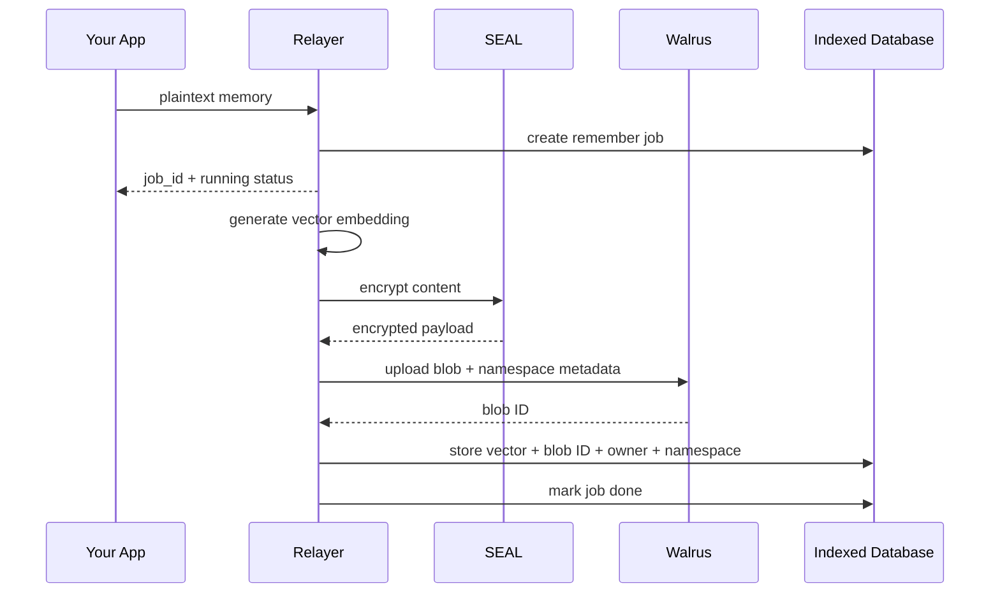
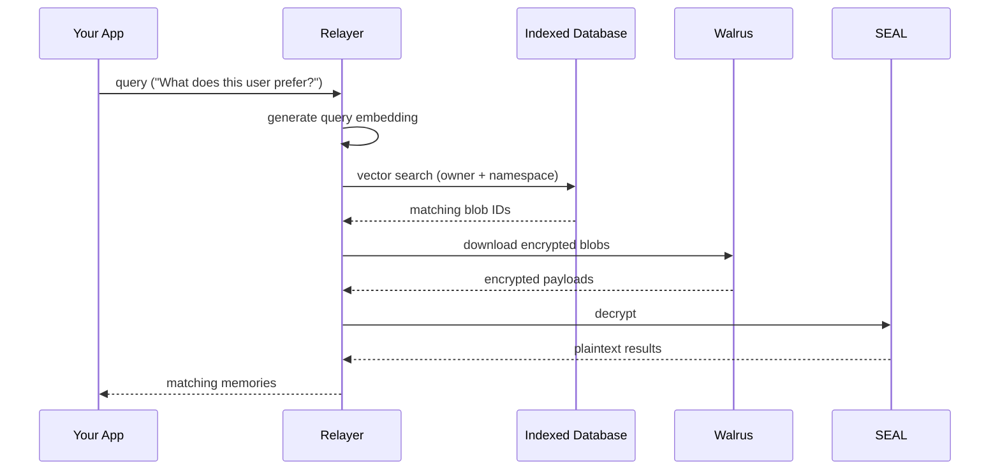
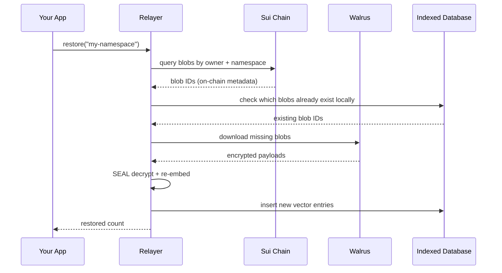

> For the complete documentation index, see [llms.txt](https://docs.wal.app/llms.txt)

When you call `memwal.remember(...)`, the relayer accepts a background job immediately and then stores the memory asynchronously. Here's what happens.

## Storing a memory

### Embedding

    The relayer generates a vector embedding from your plaintext content. This embedding is a numerical representation of the meaning of your memory, it's what makes semantic search possible during recall.

  ### Encryption

    The plaintext content is encrypted using Seal (Sui's encryption framework). The encrypted payload can only be decrypted by the owner or their authorized delegates.

  ### Blob upload

    The encrypted payload is uploaded to Walrus as a blob. Metadata including the namespace is attached so the blob can be discovered later during restore. Walrus stores it durably across a decentralized network, there's no single point of failure.

  ### Vector indexing

    The vector embedding (1536-dimensional, generated by `text-embedding-3-small`), along with the blob ID, owner address, and namespace, is stored in the `vector_entries` table in PostgreSQL with pgvector. An HNSW index on the embedding column enables fast approximate nearest neighbor search during recall.

## Recalling a memory

1. Your query is converted into a vector embedding
2. The database is searched for the closest matching vectors using pgvector's cosine distance operator (`<=>`), scoped to your memory space (`owner + namespace`)
3. Matching encrypted blobs are downloaded from Walrus concurrently
4. Each blob is decrypted through Seal using the delegate key
5. Plaintext results are returned to your app, sorted by distance (most relevant first)

> **Note**
>
> If a blob has expired on Walrus (returns 404), the relayer automatically deletes the stale vector entry from the database. This reactive cleanup keeps your recall results clean without manual intervention.
## Restoring a memory space

If the local database is lost or incomplete, the restore flow rebuilds it from Walrus, the permanent source of truth.

1. The relayer queries onchain Walrus blob objects owned by the user, filtered by namespace metadata
2. It compares against the local database to find which blobs are already indexed
3. Only missing blobs are downloaded, decrypted, re-embedded, and re-indexed
4. The restore supports a configurable `limit` (default: 10) to control how many blobs are processed per call

Restore is incremental and idempotent, you can call it multiple times safely.

## Two layers, one system

| Layer | Stores | Purpose |
|-------|--------|---------|
| **Walrus** | Encrypted blobs | Durable, decentralized source of truth |
| **PostgreSQL + pgvector** | Vector embeddings + metadata | Fast semantic search for recall |

The database is rebuildable, if it's ever lost, the restore flow can rediscover blobs from Walrus by owner and namespace, then re-embed and re-index them. Walrus is the permanent record.