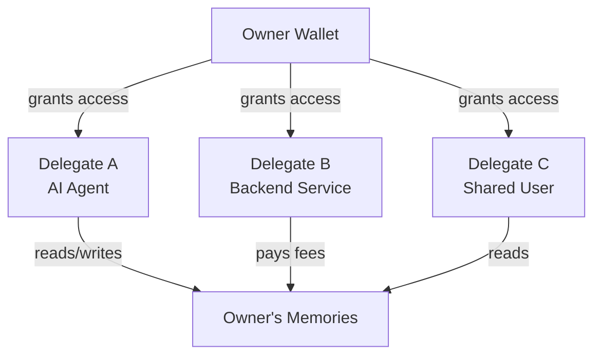

> For the complete documentation index, see [llms.txt](https://docs.wal.app/llms.txt)

Walrus Memory puts you in full control of your memory. Programmable permissions and explicit ownership define how memory is shared, accessed, and updated, with delegate access for agents and workflows.

## Ownership

Memory content in Walrus Memory is stored on Walrus and cryptographically owned by a user identified by their private key. When you pass a `key` to the SDK, it is translated into a Sui wallet address, this address is the owner.

```ts
const memwal = MemWal.create({
  key: process.env.MEMWAL_PRIVATE_KEY!, // delegate private key
  accountId: process.env.MEMWAL_ACCOUNT_ID!, // MemWalAccount object ID
  serverUrl: process.env.MEMWAL_SERVER_URL,
  namespace: "personal",
});
```

Only the owner (and their authorized delegates) can access their encrypted content or perform privileged actions over their memories. This isn't a policy promise, it's cryptographically enforced onchain.

This strong ownership model opens the door to future capabilities like a memory marketplace, where users could transfer memories or grant specific permissions for others to use their data.

## Delegates

A delegate is simply a keypair (private key) that gets translated into a Sui wallet address, just like the owner. The difference is that a delegate's access is **granted by the owner** rather than being inherent.

This enables two key use cases:

- **Shared access**, users (human or AI agents) can grant other users access to their memories. An agent could share its knowledge base with another agent, or a user could give a service read access to specific data.
- **Service delegation**, users can delegate privileges to services that act on their behalf, such as paying for transaction fees or storage costs, without handing over ownership.



## Access control enforcement

The relationship between owners and delegates is enforced on chain by the Sui smart contract system, not by application logic or database permissions.

- The owner's wallet address is the root authority over a Walrus Memory account
- Delegate keys are registered onchain and verified on every request
- The relayer checks delegate authorization against the contract before executing any operation

This means access control is tamper-proof and verifiable, no one can bypass it without the owner's explicit onchain approval.