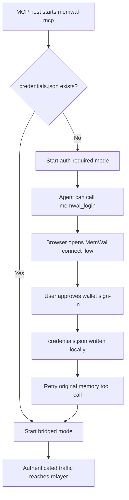

> For the complete documentation index, see [llms.txt](https://docs.wal.app/llms.txt)

This page explains what `@mysten-incubation/memwal-mcp` actually does on the client machine.

## Runtime modes

The package has two main runtime modes.

### Auth-required mode

This mode runs when:

- the package was launched by an MCP host such as Cursor, Claude Desktop, Claude Code, Codex, or Antigravity
- `~/.memwal/credentials.json` does not exist yet

Instead of exiting, the package starts a minimal MCP server that:

- responds to `initialize`
- advertises the normal Walrus Memory memory tools
- also advertises `memwal_login`
- returns an actionable error for the memory tools until sign-in completes

That is intentional. It avoids the bad UX where the MCP host only shows a vague server-start failure and gives the user no recovery path.

### Bridged mode

This mode runs after credentials exist.

The package:

- loads the saved delegate key + account metadata from `~/.memwal/credentials.json`
- opens an authenticated SSE bridge to the relayer
- forwards stdio MCP traffic from the local client to the relayer
- intercepts `memwal_login` and `memwal_logout` locally instead of forwarding them upstream

## First-run flow



## Credential file

The package stores credentials here:

```text
~/.memwal/credentials.json
```

It contains:

- delegate private key
- delegate public key
- delegate address
- wallet address
- Walrus Memory account ID
- package ID
- relayer URL
- label
- creation timestamp

The file is written with restrictive permissions (`0600`) on supported systems.

> **Warning**
>
> The delegate private key in this file is a sensitive long-lived credential. Treat it like an API key. Do not commit it, do not share it in screenshots, and do not paste it into public MCP configs.
## Local-only tools

These tools are handled locally by the package:

- `memwal_login`
- `memwal_logout`

They do **not** round-trip to the relayer.

That matters because login needs to open a browser on the client machine, and logout should only remove local credentials without mutating server state.

## Why login returns a URL instead of waiting

`memwal_login` is intentionally designed to return a click-able URL quickly instead of blocking until wallet approval finishes.

That design avoids a few common MCP-host failure modes:

- tool-call timeouts while the user approves in wallet
- browser tabs opening in the background
- agents paraphrasing a timeout error and dropping the actual login URL

The local listener stays alive in the background for up to **5 minutes**. After the browser flow completes, the next Walrus Memory tool call picks up the saved credentials automatically.

## Remote memory tools

These tools go through the relayer:

- `memwal_remember`
- `memwal_recall`
- `memwal_analyze`
- `memwal_restore`

Those requests hit the same relayer-backed Walrus Memory stack used by direct SDK clients:

- embeddings
- Seal encryption and decryption
- Walrus storage
- relayer-side indexing and retrieval

### Stdio package

Use the package when your MCP host expects a local command:

```json
{
  "mcpServers": {
    "memwal": {
      "command": "npx",
      "args": ["-y", "@mysten-incubation/memwal-mcp"]
    }
  }
}
```

This is the path that supports inline `memwal_login`.

In bridged mode, the package also:

- opens an authenticated SSE session to the relayer
- forwards stdio MCP requests upstream
- splices `memwal_login` and `memwal_logout` into `tools/list`
- transparently reconnects if the SSE session drops

### Streamable HTTP

Use HTTP transport when the MCP host can connect directly to a remote MCP URL and attach headers.

The typical endpoint is:

```text
https://relayer.memory.walrus.xyz/api/mcp
```

with request headers:

- `Authorization: Bearer <delegatePrivateKey>`
- `x-memwal-account-id: <accountId>`

This is a different surface from the local stdio package. The auth and session flow are not identical.

## Safety decisions in the runtime

Some runtime behavior is opinionated on purpose:

- **401 does not auto-delete credentials**: a relayer `401` is surfaced loudly, but the local credentials file is left untouched so transient proxy, WAF, or local-network issues do not wipe the user's saved delegate key
- **`--relayer` override is transient-only**: if a saved credentials file points at one relayer and the current process passes another `--relayer`, the override applies only to that process and does not silently rewrite the saved file
- **Login callback is loopback-only**: the browser callback listener binds to `127.0.0.1`, checks the request `Origin`, validates the `Host`, and compares a one-time `state` token before writing credentials

## Environment presets

The package supports presets that set both relayer and dashboard URLs together:

- `--prod`
- `--dev`
- `--staging`
- `--local`

This matters because login should open the dashboard that matches the relayer environment. For example, `--dev` should route the user to the dev dashboard and save dev relayer credentials, not silently fall back to prod.

## What logout does and does not do

`memwal_logout` or `--logout`:

- deletes `~/.memwal/credentials.json`
- removes local access from this machine

It does **not**:

- revoke the onchain delegate key
- remove the delegate from the Walrus Memory dashboard

If you need full revocation, remove the delegate key from the dashboard too.

## Why docs say “retry the tool call”

`memwal_login` returns a click-able URL quickly and lets the browser flow finish in the background.

That avoids MCP tool-call timeouts when:

- the user takes time to approve in wallet
- the browser tab is not focused immediately
- the wallet requires extra review or hardware confirmation

Once the browser shows the connection succeeded, the next Walrus Memory tool call picks up the saved credentials.

## Related pages

- [Quick Start](/walrus-memory/mcp/quick-start)
- [Reference](/walrus-memory/mcp/reference)
- [Changelog](/walrus-memory/mcp/changelog)