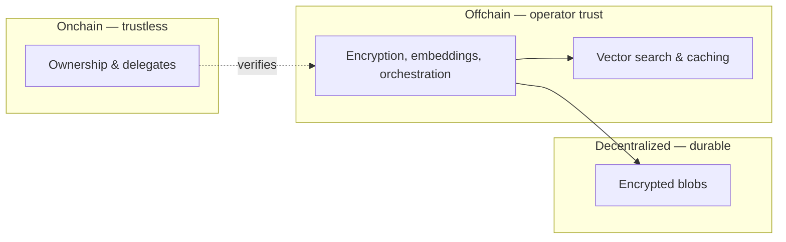

> For the complete documentation index, see [llms.txt](https://docs.wal.app/llms.txt)

Walrus Memory's security model is split between onchain enforcement and offchain operations. Understanding where trust lives helps you make informed decisions about your deployment.

## What's enforced onchain

These guarantees are cryptographic and tamper-proof, no one can bypass them:

- **Ownership**, only the owner's private key controls a Walrus Memory account
- **Delegate authorization**, delegate keys are registered and verified onchain
- **Access control**, the smart contract determines who can act on an account

Even a compromised relayer cannot change who owns an account or forge delegate permissions.

## Where the relayer is trusted

The relayer abstracts Web3 complexity to give developers a basic REST API. This convenience comes with a trust trade-off, the relayer handles sensitive operations on behalf of users:

| What the relayer sees | Why |
|----------------------|-----|
| Plaintext memory content | It generates embeddings and encrypts before storing |
| Decrypted content on recall | It decrypts blobs to return results to the SDK |
| Vector embeddings | It stores and searches them for semantic recall |

This means the **relayer operator can see your data in transit**. This is similar to how a traditional backend API works, your server sees the data it processes.

## Mitigating relayer trust

You have options depending on your trust requirements:

| Option | Trust level | What the relayer sees |
|--------|------------|----------------------|
| **Managed relayer** | You trust Walrus Foundation | Plaintext content, embeddings, decrypted results |
| **Self-hosted relayer** | You trust your own infra | Same as above, but under your control |
| **TEE relayer pattern** | You trust the attested enclave identity and configured external services | Plaintext inside the enclave; host trust is reduced only if attestation is verified |
| **Manual client flow** | Minimal trust | Only encrypted payloads and pre-computed vectors, never plaintext |

- **Use the managed relayer**, convenient for getting started and prototyping. You trust Walrus Foundation to operate it responsibly.
- **Self-host your own relayer**, you control the infrastructure, so the trust boundary is entirely yours. No third party sees your data.
- **Run the relayer in a TEE**, move plaintext processing into an attested enclave. This reduces trust in the host operator, but clients or gateway policy must verify the enclave identity before treating it as a TEE-backed deployment.
- **Manual client flow**, use `MemWalManual` to handle encryption and embedding entirely on the client side. The relayer only sees encrypted payloads and vectors, never plaintext. This is recommended for Web3-native users who want full control over their data and are comfortable managing keys, signing, and Seal operations directly.

## What lives where

[Source: fundamentals/architecture/data-flow-security-model.md](https://github.com/MystenLabs/MemWal/blob/dev/docs/fundamentals/architecture/data-flow-security-model.md)

- **Onchain (trustless)**: ownership, delegate keys, access control, enforced by Sui smart contracts
- **Offchain (operator trust)**: encryption, embedding, search, handled by the relayer and indexed database
- **Decentralized (durable)**: encrypted memory payloads, stored on Walrus, no single point of failure

## Authentication flow

Every protected API call goes through Ed25519 signature verification:

1. The SDK signs a message: `{timestamp}.{method}.{path_and_query}.{body_sha256}.{nonce}.{account_id}` using the delegate private key
2. The relayer verifies the Ed25519 signature against the provided public key
3. Timestamps must be within a **5-minute window**, and each `x-nonce` UUID is recorded in Redis for replay protection
4. The relayer resolves the public key to a `MemWalAccount` using the priority chain: cache → signed account header/config fallback → onchain registry scan
5. The onchain account is fetched to verify the delegate key is registered in `delegate_keys`
6. The resolved owner address is used to scope all subsequent operations

## Current status

This describes the production beta model. The trust boundaries are designed to evolve, future versions might introduce client-side encryption by default or additional verifiability layers. Self-hosting remains the strongest option for teams that need full control today.