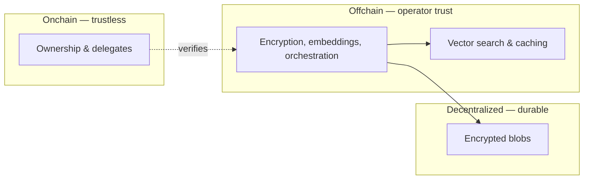

> For the complete documentation index, see [llms.txt](https://docs.wal.app/llms.txt)

Walrus Memory's security model is split between onchain enforcement and offchain operations. Understanding where trust lives helps you make informed decisions about your deployment.

  
  
    Data on Walrus is public and immutable, so encrypting memory content before upload provides confidentiality, and ownership and delegate rules on Sui enforce access. The diagram cycles through four deployment models, which differ in where plaintext lives. A managed relayer receives plaintext, generates embeddings, and encrypts before storing, so you trust its operator. Self-hosting keeps that same flow inside infrastructure you control. A TEE relayer processes plaintext only inside an attested enclave, and you must verify the attestation. Only the manual client flow encrypts on the client, so the relayer handles only ciphertext and precomputed vectors.
  

## What's enforced onchain

These guarantees are cryptographic and tamper-proof, and no one can bypass them:

- **Ownership**: only the owner's private key controls a Walrus Memory account
- **Delegate authorization**: the smart contract registers and verifies delegate keys onchain
- **Access control**: the smart contract determines who can act on an account

Even a compromised relayer cannot change who owns an account or forge delegate permissions.

## Where the relayer is trusted

The relayer abstracts Web3 complexity to give developers a basic REST API. This convenience comes with a trust trade-off, because the relayer handles sensitive operations on behalf of users:

| **What the relayer sees** | **Why** |
|----------------------|-----|
| Plaintext memory content | It generates embeddings and encrypts before storing |
| Decrypted content on recall | It decrypts blobs to return results to the SDK |
| Vector embeddings | It stores and searches them for semantic recall |

This means the **relayer operator can see your data in transit**. This is similar to how a traditional backend API works: your server sees the data it processes.

## Mitigating relayer trust

You have options depending on your trust requirements:

| **Option** | **Trust level** | **What the relayer sees** |
|--------|------------|----------------------|
| **Managed relayer** | You trust Walrus Foundation | Plaintext content, embeddings, decrypted results |
| **Self-hosted relayer** | You trust your own infra | Same as above, but under your control |
| **TEE relayer pattern** | You trust the attested enclave identity and configured external services | Plaintext inside the enclave; you reduce host trust only by verifying attestation |
| **Manual client flow** | Minimal trust | Only encrypted payloads and pre-computed vectors, never plaintext |

- **Use the managed relayer**: convenient for getting started and prototyping. You trust Walrus Foundation to operate it responsibly.
- **Self-host your own relayer**: you control the infrastructure, so the trust boundary is entirely yours. No third party sees your data.
- **Run the relayer in a TEE**: move plaintext processing into an attested enclave. This reduces trust in the host operator, but clients or gateway policy must verify the enclave identity before treating it as a TEE-backed deployment.
- **Manual client flow**: use `MemWalManual` to handle encryption and embedding entirely on the client side. The relayer only sees encrypted payloads and vectors, never plaintext. This flow suits Web3-native users who want full control over their data and are comfortable managing keys, signing, and Seal operations directly.

## What lives where

[Source: fundamentals/architecture/data-flow-security-model.md](https://github.com/MystenLabs/MemWal/blob/dev/docs/fundamentals/architecture/data-flow-security-model.md)

```mermaid
flowchart LR
    subgraph Onchain [Onchain — trustless]
        Contract[Ownership & delegates]
    end
    subgraph Offchain [Offchain — operator trust]
        Relayer[Encryption, embeddings, orchestration]
        DB[Vector search & caching]
    end
    subgraph Decentralized [Decentralized — durable]
        Walrus[Encrypted blobs]
    end

    Contract -. verifies .-> Relayer
    Relayer --> DB
    Relayer --> Walrus
```

- **Onchain (trustless)**: Sui smart contracts enforce ownership, delegate keys, and access control
- **Offchain (operator trust)**: the relayer and indexed database handle encryption, embedding, and search
- **Decentralized (durable)**: Walrus stores encrypted memory payloads with no single point of failure

## Authentication flow

Every protected API call goes through Ed25519 signature verification:

1. The SDK signs a message: `{timestamp}.{method}.{path_and_query}.{body_sha256}.{nonce}.{account_id}` using the delegate private key
2. The relayer verifies the Ed25519 signature against the provided public key
3. Timestamps must be within a **5-minute window**, and the relayer records each `x-nonce` UUID in Redis for replay protection
4. The relayer resolves the public key to a `MemWalAccount` using the priority chain: cache first, then the signed account header or config fallback, then an onchain registry scan
5. The relayer fetches the onchain account to verify the delegate key appears in `delegate_keys`
6. The relayer scopes all subsequent operations to the resolved owner address

## Current status

This describes the current production model. The trust boundaries continue to evolve: future versions might introduce client-side encryption by default or additional verifiability layers. Self-hosting remains the strongest option for teams that need full control today.