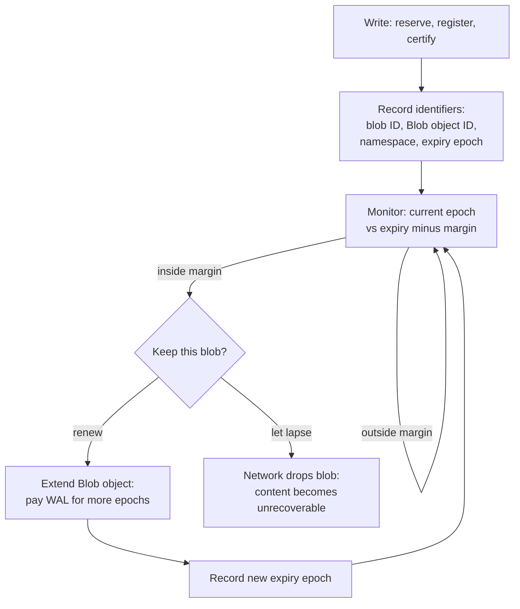

> For the complete documentation index, see [llms.txt](https://docs.wal.app/llms.txt)

Every memory an agent writes becomes a durable object on two systems: an encrypted blob on Walrus, and a `Blob` object on Sui that records who owns that blob and how long it lives. An agent that depends on its memory has to know which blobs it owns, when each one expires, and when to renew or drop it.

An agent that writes and recalls through a relayer rarely touches these objects directly, because the relayer owns and manages them. The object model below matters when an agent holds its own tokens and manages its own blob lifecycle, or when you need to audit what an agent owns. For who pays for storage, see [How an Agent Funds Walrus Storage](/walrus-memory/fundamentals/architecture/funding-storage).

## What an agent owns

A single write produces more than one tracked object. Keep the roles separate, because each one has a different owner and a different lifetime.

| **Object** | **Lives on** | **What it represents** | **Why the agent tracks it** |
| --- | --- | --- | --- |
| Encrypted blob | Walrus | The Seal-encrypted memory content, stored across the decentralized network | The durable source of truth for the memory |
| `Blob` object | Sui | The onchain record of the blob: its blob ID, size, namespace metadata, and expiry epoch | Controls the lifecycle: extend, delete, or burn |
| Storage resource | Sui | Reserved storage capacity for a size and epoch range | Pre-bought capacity the agent spends on writes |
| Vector entry | Relayer database | The embedding plus blob ID that makes recall fast | Rebuildable from Walrus, so it is not the source of truth |

The blob content on Walrus is the permanent record. The `Blob` object on Sui is what the agent uses to manage that record. Whoever owns the `Blob` object controls the blob's lifecycle, so ownership of that object matters as much as ownership of the content.

> **Note**
>
> The vector entry in the relayer database is the only object in this list that is not a source of truth. If it is lost, the [restore flow](/walrus-memory/fundamentals/architecture/how-storage-works) rebuilds it from the blobs the agent still owns on Walrus. The other three objects are the record.
## The lifecycle of one blob

A blob moves through a predictable set of states from the moment the agent writes it. The agent's job is to know which state each blob is in and act before the blob expires.

[Source: fundamentals/architecture/tracking-agent-storage.md](https://github.com/MystenLabs/MemWal/blob/dev/docs/fundamentals/architecture/tracking-agent-storage.md)



### Register and certify

    A write reserves storage, registers the blob, and certifies it on Sui. When certification completes, the network holds the encrypted data and Sui holds a `Blob` object owned by the writer's address. This is the point at which the agent owns a tracked blob.

  ### Record the identifiers

    The agent captures the identifiers it needs to find the blob again: the blob ID, the `Blob` object ID on Sui, the namespace the memory belongs to, and the expiry epoch. Without these, the agent cannot renew or delete the blob later.

  ### Monitor expiry

    A blob lives only for the epochs the agent paid for. An epoch is about 2 weeks on Mainnet and about 1 day on Testnet. The agent watches the current epoch against each blob's expiry epoch and flags blobs that approach expiry.

  ### Renew or drop

    Before a blob expires, the agent either extends its lifetime for more epochs or lets it lapse. When the agent lets a blob lapse, the network drops it and no one can recover its content. An agent with durable memory runs an extend-before-expiry loop.

## Three ways to find what an agent owns

An agent does not need a separate database to know what it owns, because ownership is already recorded on Sui and on Walrus. Use the source that fits the moment.

### 1. Capture identifiers at write time

The most direct record is the one the agent builds as it writes. Every `remember` result carries the blob ID once the job reaches `done`, so the agent can append it to its own index as it goes.

[Source: fundamentals/architecture/tracking-agent-storage.md](https://github.com/MystenLabs/MemWal/blob/dev/docs/fundamentals/architecture/tracking-agent-storage.md)

```ts
const settled = await memwal.rememberBulkAndWait(items);
for (const result of settled.results) {
  if (result.status === "done") {
    myIndex.record({ blobId: result.blob_id, namespace: "agent-state" });
  }
}
```

This index is a convenience, not the source of truth. Treat it as a cache the agent can rebuild, because the authoritative record lives on Sui and Walrus.

### 2. Query the chain by owner and namespace

Because a Sui address owns every `Blob` object, the agent can ask the chain directly which blobs an address owns, filtered by the namespace metadata attached at write time. This is the same discovery the relayer performs during restore, and it works even if the agent loses all of its local state.

The relayer exposes this through `restore`, which queries onchain blobs for the caller's owner and namespace, then rebuilds the vector index for any it finds:

[Source: fundamentals/architecture/tracking-agent-storage.md](https://github.com/MystenLabs/MemWal/blob/dev/docs/fundamentals/architecture/tracking-agent-storage.md)

```ts
// Rediscover blobs the agent owns in this namespace and re-index them.
const result = await memwal.restore("agent-state");
console.log(`restored=${result.restored} skipped=${result.skipped} total=${result.total}`);
```

Restore's `limit` (default 10) caps how many onchain blobs it inspects, newest-first, so `total` is the number of blobs the relayer inspected in that call, not a full count of everything the agent owns in the namespace. Restore has no pagination cursor, so repeating a call at the same limit re-inspects the same newest blobs and returns nothing new. To enumerate or rebuild a large namespace, rerun restore with a progressively higher `limit` until `restored` stops increasing. When the agent needs an exact, unbounded count, query the chain directly for the `Blob` objects the address owns rather than reading it off a single restore call.

### 3. Read the `Blob` object on Sui

When the agent needs the details of a specific blob, such as its size or exact expiry epoch, it reads the `Blob` object on Sui by its object ID. The object carries the expiry epoch that drives every renewal decision.

## Track expiry and renew on time

Expiry is the one part of the lifecycle that fails silently. A blob does not warn the agent before it lapses, so the agent has to compare the current epoch against each blob's expiry epoch on a schedule.

Renewal is an extend operation on the `Blob` object: the owner pays WAL for more epochs and the expiry epoch moves forward. New assets that you upload through the console renew automatically. The manual loop below is the self-managed case, for agents that own and manage their blobs, which [Manage Your Memory](/walrus-memory/guides/manage-your-memory) covers from the memory side. For an agent that manages its own blobs, run the check as a loop:

1. Read the current Walrus epoch.
2. For each tracked blob, compare its expiry epoch against the current epoch plus a safety margin.
3. Extend any blob inside the margin for another block of epochs.
4. Record the new expiry epoch so the next pass sees the updated value.

> **Warning**
>
> Choose a safety margin larger than your renewal interval. If the agent checks once per epoch but only renews blobs expiring in the next epoch, a single missed run drops data. A margin of several epochs gives the loop room to recover from a missed cycle.
Storage resources follow the same ownership rule. A storage resource is a transferable Sui object that represents reserved capacity, so an agent can hold pre-bought capacity and spend it on writes without swapping WAL each time. The agent tracks storage resources the same way it tracks blobs: by object ID on Sui, watching the epochs each resource covers.

## Ownership in sponsored writes

When a sponsor runs the write, ownership of the resulting `Blob` object does not automatically land with the agent. By default, a publisher's sub-wallet owns the blob it creates. If the agent is meant to manage the blob's lifecycle, the sponsor sets the publisher's `send-object-to` parameter to the agent's Sui address so the `Blob` object transfers to the agent after upload.

Confirm where the object landed before you assume the agent can renew it. An agent that believes it owns a blob it does not own cannot extend that blob, and the data lapses on the sponsor's schedule rather than the agent's. For the full set of sponsored patterns and who ends up owning the blob in each one, see [How an Agent Funds Walrus Storage](/walrus-memory/fundamentals/architecture/funding-storage).