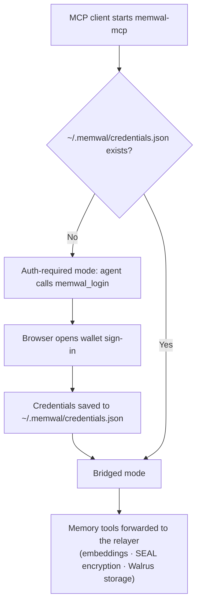

> For the complete documentation index, see [llms.txt](https://docs.wal.app/llms.txt)

The **Walrus Memory MCP server** exposes your portable Walrus Memory as Model Context Protocol tools, so an AI agent can decide when to save and recall memories on its own. It works with any MCP-aware client, and on **Claude Code**, **Codex**, **Cursor**, and **Antigravity** it can be installed as a **plugin** that adds automatic memory through lifecycle hooks.

## MCP Vs plugin

There are two ways to use Walrus Memory. The difference is whether you also get the **lifecycle hooks**:

| Component | **Plugin** | **MCP-only** |
|---|:-:|:-:|
| Walrus Memory MCP: memory tools (`memwal_remember`, `memwal_recall`, …) | ✓ | ✓ |
| Lifecycle hooks: automatic recall/save reminders | ✓ | ✗ |

- **MCP-only** gives the agent the memory tools. Because the tool descriptions encourage proactive use, the agent already saves and recalls on its own; you just do not get the hooks. Available on **every** MCP client.
- **Plugin** bundles the MCP server **and** lifecycle hooks that reinforce the behavior (for example, preferring Walrus Memory over a client's built-in memory). Available on **Claude Code**, **Codex**, **Antigravity**, and **Cursor**.

> **Note**
>
> The proactive behavior comes from the tool layer, so it works on both installation paths. The plugin hooks add reinforcement on the clients that support them.
## Available tools

| Tool | Description |
|------|-------------|
| `memwal_remember` | Save a durable fact for the user (preference, decision, constraint, identity). |
| `memwal_remember_bulk` | Save several distinct facts in one call. |
| `memwal_recall` | Semantic search across stored memories for relevant context. |
| `memwal_analyze` | Extract and save multiple facts from a passage of text. |
| `memwal_restore` | Rebuild the search index from Walrus when recall is unexpectedly empty. |
| `memwal_health` | Fast connectivity check (no search or decryption). |
| `memwal_login` | Connect this client to your account through browser wallet sign-in. |
| `memwal_logout` | Remove the saved credentials from this machine. |

See [Reference](/walrus-memory/mcp/reference) for full parameters, CLI flags, and transports.

## How it works

The npm package (`@mysten-incubation/memwal-mcp`) runs locally next to your MCP client and bridges every memory tool call to the Walrus Memory relayer, which handles embeddings, Seal encryption, and Walrus storage.

[Source: mcp/overview.md](https://github.com/MystenLabs/MemWal/blob/dev/docs/mcp/overview.md)

- **First run (no credentials):** the server still starts and exposes `memwal_login`, so the agent signs you in inline instead of failing with a vague startup error. The login tool returns a clickable URL (valid 5 minutes); after you approve in the browser, the next tool call picks up the credentials automatically.
- **Credential file:** login writes `~/.memwal/credentials.json` (mode `0600`) containing your delegate key and account metadata. The delegate private key is a sensitive, long-lived credential; treat it like an API key.
- **Local vs remote tools:** the package handles `memwal_login` / `memwal_logout` locally (they never reach the relayer) and forwards all memory tools (`memwal_remember`, `memwal_recall`, …) to the relayer over an authenticated session.
- **Logout** deletes only the local credential file. To fully revoke access, also remove the delegate key from the dashboard.

See [Reference](/walrus-memory/mcp/reference) for the credential file contents, transports (stdio vs HTTP), and runtime safety details.

## Client-specific setup

  
    Plugin (automatic memory) or MCP-only
  
  
    Plugin (automatic memory) or MCP-only
  
  
    Plugin or MCP-only
  
  
    MCP-only
  
  
    Plugin or MCP-only
  
  
    MCP-only
  
  
    Tools, CLI flags, transports, self-hosting
  

## Verify your setup

Ask the agent in any conversation:

> What MCP tools do you have available?

You should see the `memwal_*` tools. Then state a durable fact (for example, a preferred package manager) and confirm the agent saves it with `memwal_remember` and recalls it in a later session.

## Quick recovery

If `memwal_recall` returns nothing although you saved before (a new machine, a fresh relayer, or after switching servers), run `memwal_restore <namespace>` to rebuild the search index from the durable Walrus blobs, then recall again.