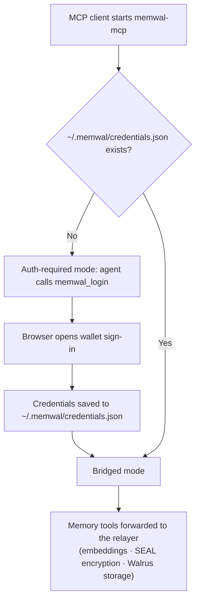

> For the complete documentation index, see [llms.txt](https://docs.wal.app/llms.txt)

The **Walrus Memory MCP server** exposes your portable Walrus Memory as Model Context Protocol tools, so an AI agent can decide when to save and recall memories on its own. It works with any MCP-aware client, and on **Claude Code**, **Codex**, **Cursor**, and **Antigravity** it can be installed as a **plugin** that adds automatic memory through lifecycle hooks.

## MCP Vs plugin

There are two ways to use Walrus Memory. The difference is whether you also get the **lifecycle hooks**:

| Component | **Plugin** | **MCP-only** |
|---|:-:|:-:|
| Walrus Memory MCP: memory tools (`memwal_remember`, `memwal_recall`, …) | ✓ | ✓ |
| Lifecycle hooks: automatic recall/save reminders | ✓ | ✗ |

- **Plugin** bundles the MCP server **and** lifecycle hooks. The `SessionStart` hook tells the agent to prefer the `memwal_*` tools over any built-in or local memory feature, and when to save without being asked. Automatic memory works with no further instructions from you. Available on **Claude Code**, **Codex**, **Antigravity**, and **Cursor**.
- **MCP-only** gives the agent the memory tools on **every** MCP client. The tool descriptions encourage proactive use, so agents often do save and recall on their own. Treat that as best-effort: it varies by client and model, and on a client that ships its own memory feature the built-in one commonly wins.

> **Note**
>
> Prefer the plugin wherever you can install it. It is the tested path for reliable automatic save and recall, and it needs no extra instructions from you. On MCP-only clients, paste the client's instruction block (see [Claude Desktop](/walrus-memory/mcp/claude-desktop#add-memory-instructions)) to get closer to the same behavior.
## Fastest path: let your agent set it up

Paste this into the AI client you want to connect:

[Source: mcp/overview.md](https://github.com/MystenLabs/MemWal/blob/dev/docs/mcp/overview.md)

```text
Run `curl -sL https://memory.walrus.xyz/skills/setup` and use the returned
instructions to connect Walrus Memory to this AI client.
```

The agent identifies the client, writes the right config or runs the right install
command, signs you in, and verifies the memory tools. Use the per-client table below
if you would rather do it by hand.

## Which install path for your client

What the user actually does differs per client. Pick your row:

| Client | Automatic memory (hooks) | What you do |
|---|:-:|---|
| [Claude Code](/walrus-memory/mcp/claude-code) | ✓ Plugin | `/plugin marketplace add MystenLabs/MemWal`, then `/plugin install memwal@memwal-plugins` |
| [Codex](/walrus-memory/mcp/codex) | ✓ Plugin | `codex plugin marketplace add MystenLabs/MemWal`, then `codex plugin add memwal@memwal-plugins`, then trust the hooks through `/hooks` |
| [Antigravity](/walrus-memory/mcp/antigravity) | ✓ Plugin | `npx degit MystenLabs/MemWal/packages/mcp/plugin ~/.gemini/config/plugins/memwal` |
| [Cursor](/walrus-memory/mcp/cursor) | ✓ Plugin | `npx -y degit MystenLabs/MemWal/packages/mcp/plugin ~/.cursor/plugins/local/memwal` |
| [Claude Desktop](/walrus-memory/mcp/claude-desktop) | ✗ MCP-only | Edit `claude_desktop_config.json`, then [add memory instructions](/walrus-memory/mcp/claude-desktop#add-memory-instructions) |
| [OpenCode](/walrus-memory/mcp/opencode) | ✗ MCP-only | Edit the OpenCode MCP config |
| ChatGPT desktop app | ✓ Plugin | Ships Codex, so follow [Codex](/walrus-memory/mcp/codex) |
| ChatGPT web (Connectors) | ✗ Not supported | n/a |

On the plugin rows, that command is the whole setup. The plugin's hooks carry the memory
instructions, so you do not need to add routing text to `CLAUDE.md`, `AGENTS.md`, or a
system prompt yourself.

> **Note**
>
> **"ChatGPT" means two different things here.** The macOS **ChatGPT desktop app** ships
> Codex (`/Applications/ChatGPT.app/Contents/Resources/codex`) and reads the same
> `~/.codex/config.toml`, so the [Codex](/walrus-memory/mcp/codex) plugin install works there unchanged.
> 
> **ChatGPT web connectors are not supported.** Walrus Memory's remote
> [Streamable HTTP transport](/walrus-memory/mcp/reference#transports) needs two custom headers, but the
> Connectors UI exposes only a single bearer field and cannot supply the required
> `x-memwal-account-id` header.
## Available tools

| Tool | Description |
|------|-------------|
| `memwal_remember` | Save a durable fact for the user (preference, decision, constraint, identity). |
| `memwal_remember_bulk` | Save several distinct facts in one call. |
| `memwal_recall` | Semantic search across stored memories for relevant context. |
| `memwal_analyze` | Extract and save multiple facts from a passage of text. |
| `memwal_restore` | Rebuild the search index from Walrus when recall is unexpectedly empty. |
| `memwal_health` | Fast connectivity check (no search or decryption). |
| `memwal_login` | Connect this client to your account through browser wallet sign-in. |
| `memwal_logout` | Remove the saved credentials from this machine. |

`memwal_recall` prints `score = 1 - cosine distance` (higher = more similar); the wire and SDK field is `distance`.

See [Reference](/walrus-memory/mcp/reference) for full parameters, CLI flags, and transports.

## How it works

The npm package (`@mysten-incubation/memwal-mcp`) runs locally next to your MCP client and bridges every memory tool call to the Walrus Memory relayer, which handles embeddings, Seal encryption, and Walrus storage.

[Source: mcp/overview.md](https://github.com/MystenLabs/MemWal/blob/dev/docs/mcp/overview.md)


```mermaid
flowchart TD
  A["MCP client starts memwal-mcp"] --> B{"~/.memwal/credentials.json exists?"}
  B -- "No" --> C["Auth-required mode: agent calls memwal_login"]
  C --> D["Browser opens wallet sign-in"]
  D --> E["Credentials saved to ~/.memwal/credentials.json"]
  E --> F["Bridged mode"]
  B -- "Yes" --> F
  F --> G["Memory tools forwarded to the relayer<br/>(embeddings · SEAL encryption · Walrus storage)"]
```

- **First run (no credentials):** the server still starts and exposes `memwal_login`, so the agent signs you in inline instead of failing with a vague startup error. The login tool returns a clickable URL (valid 5 minutes); after you approve in the browser, the next tool call picks up the credentials automatically.
- **Credential file:** login writes `~/.memwal/credentials.json` (mode `0600`) containing your delegate key and account metadata. The delegate private key is a sensitive, long-lived credential; treat it like an API key.
- **Local vs remote tools:** the package handles `memwal_login` / `memwal_logout` locally (they never reach the relayer) and forwards all memory tools (`memwal_remember`, `memwal_recall`, …) to the relayer over an authenticated session.
- **Logout** deletes only the local credential file. To fully revoke access, also remove the delegate key from the dashboard.

See [Reference](/walrus-memory/mcp/reference) for the credential file contents, transports (stdio vs HTTP), and runtime safety details.

## Client-specific setup

  
    Plugin (automatic memory) or MCP-only
  
  
    Plugin (automatic memory) or MCP-only
  
  
    Plugin or MCP-only
  
  
    MCP-only
  
  
    Plugin or MCP-only
  
  
    MCP-only
  
  
    Tools, CLI flags, transports, self-hosting
  

## Verify your setup

Ask the agent in any conversation:

> What MCP tools do you have available?

You should see the `memwal_*` tools. Then state a durable fact (for example, a preferred package manager) and confirm the agent saves it with `memwal_remember` and recalls it in a later session.

## Quick recovery

If `memwal_recall` returns nothing although you saved before (a new machine, a fresh relayer, or after switching servers), run `memwal_restore <namespace>` to rebuild the search index from the durable Walrus blobs, then recall again.