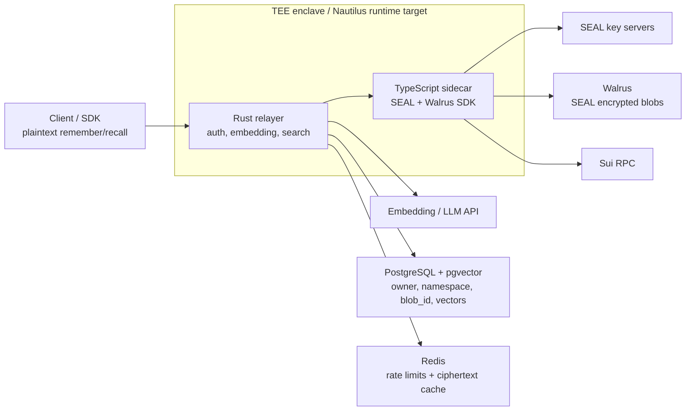

> For the complete documentation index, see [llms.txt](https://docs.wal.app/llms.txt)

Run the Walrus Memory relayer with a TEE deployment pattern when you want the default
SDK flow without giving the host operator direct access to plaintext memory
payloads. The goal is a tamper-resistant, hardware-attested deployment: incoming
memories might still be plaintext at the relayer API boundary, but the relayer
processes them inside a TEE and sends Seal-encrypted ciphertext out to Walrus.

This pattern keeps the existing relayer behavior: clients send plaintext to the
relayer, the relayer embeds and Seal-encrypts it, encrypted blobs go to Walrus,
and PostgreSQL stores searchable vector metadata. The difference is that the
plaintext boundary moves from a normal host process into the enclave.

> **Note**
>
> This is a deployment pattern, not a separate relayer implementation. Validate the
> manifest fields against the Nautilus version you deploy with, and use the
> reference files in `services/server/deploy/nautilus` as the Walrus Memory-specific
> starting point.
> **Warning**
>
> This template is not a complete Sui Nautilus application by itself. A full
> Nautilus integration also needs enclave attestation or measurement verification
> and, when required by your trust model, Move-side verification of the TEE output
> or registered enclave identity.
## What this provides

| Layer | Status |
| --- | --- |
| Relayer runtime | Uses the existing Rust relayer and TypeScript sidecar |
| TEE-oriented image | Provides a wrapper `Containerfile` and entrypoint checks |
| Runtime config | Provides a manifest example and secret/env template |
| Local smoke test | Verifies Docker image boot, sidecar readiness, `/health`, and `/metrics` |
| Nautilus deployment | Requires your Nautilus CLI/platform to build and run the enclave image |
| Attestation verification | Must be wired through your Nautilus/Sui verification path before clients rely on it |

## Architecture flow

[Source: relayer/nautilus-tee.md](https://github.com/MystenLabs/MemWal/blob/dev/docs/relayer/nautilus-tee.md)



Write path:

1. Client sends plaintext to the TEE relayer.
2. The relayer validates delegate-key auth and generates embeddings inside the enclave.
3. The sidecar Seal-encrypts the plaintext inside the enclave.
4. The sidecar uploads only Seal ciphertext to Walrus.
5. PostgreSQL stores `owner`, `namespace`, `blob_id`, blob size, and pgvector embeddings.

Recall path:

1. Client sends a plaintext query to the TEE relayer.
2. The relayer embeds the query and searches pgvector by `owner + namespace`.
3. The sidecar downloads matching ciphertext blobs from Walrus and Seal-decrypts inside the enclave.
4. The relayer returns plaintext matches to the authenticated client.

## Reference template

Template files:

| File | Purpose |
| --- | --- |
| `services/server/deploy/nautilus/README.md` | Operator checklist and file map |
| `services/server/deploy/nautilus/Containerfile` | TEE wrapper image that adds the runtime entrypoint |
| `services/server/deploy/nautilus/Makefile` | Local build, run, and health-smoke helpers |
| `services/server/deploy/nautilus/run.sh` | Runtime entrypoint with required-env validation |
| `services/server/deploy/nautilus/host-forwarder.sh` | Optional host-side VSOCK bridge helper for Nitro-style deployments |
| `services/server/deploy/nautilus/nautilus.toml.example` | Reference Nautilus manifest values for this service |
| `services/server/deploy/nautilus/runtime.env.example` | Runtime environment and secret mapping |

Copy the template before editing:

[Source: relayer/nautilus-tee.md](https://github.com/MystenLabs/MemWal/blob/dev/docs/relayer/nautilus-tee.md)

```bash
$ cp services/server/deploy/nautilus/nautilus.toml.example .nautilus.toml
$ cp services/server/deploy/nautilus/runtime.env.example .env.nautilus
```

Then replace placeholder values and wire `.env.nautilus` into your Nautilus or
CI secret mechanism. Do not bake secrets into the enclave image.

Build the reference image from the repo root:

[Source: relayer/nautilus-tee.md](https://github.com/MystenLabs/MemWal/blob/dev/docs/relayer/nautilus-tee.md)

```bash
$ make -C services/server/deploy/nautilus build
```

That target first builds the existing `services/server/Dockerfile` runtime image,
then builds the TEE wrapper image from `Containerfile`. Use Nautilus to build and
deploy the enclave image from that payload, then pin the image measurement or
attestation identity produced by the deployment. The exact build/publish/run
commands are Nautilus-version specific; the Walrus Memory requirements are the runtime
variables and external endpoints listed below.

For a local container smoke test with a filled env file:

[Source: relayer/nautilus-tee.md](https://github.com/MystenLabs/MemWal/blob/dev/docs/relayer/nautilus-tee.md)

```bash
$ make -C services/server/deploy/nautilus run-local ENV_FILE=.env.nautilus
$ make -C services/server/deploy/nautilus smoke RELAYER_URL=http://127.0.0.1:8000
```

Local Docker smoke tests only prove that the image and relayer entrypoint boot.
They do not prove the process is running inside a TEE and do not produce a
Nautilus attestation or onchain verification result.

## Required runtime variables

These map directly to the existing self-hosted relayer config.

| Variable | Secret | Notes |
| --- | --- | --- |
| `DATABASE_URL` | yes | PostgreSQL connection string. `pgvector` must exist before boot |
| `REDIS_URL` | yes | Required for rate limits and Redis-backed caches |
| `MEMWAL_PACKAGE_ID` | no | Walrus Memory package used for Seal policy and blob metadata |
| `MEMWAL_REGISTRY_ID` | no | Account registry object ID |
| `SUI_NETWORK` | no | `mainnet` or `testnet` |
| `SUI_RPC_URL` | no | Sui fullnode endpoint reachable from the enclave |
| `SERVER_SUI_PRIVATE_KEY` | yes | Primary server key for Seal decrypt authorization |
| `SERVER_SUI_PRIVATE_KEYS` | yes | Optional upload key pool; takes priority for Walrus uploads |
| `SEAL_SERVER_CONFIGS` or `SEAL_KEY_SERVERS` | maybe | Optional Seal override. Defaults use the Mysten Testnet committee aggregator where available; use `SEAL_SERVER_CONFIGS` for custom committees |
| `OPENAI_API_KEY` | yes | Embedding and LLM provider key |
| `OPENAI_API_BASE` | no | OpenAI-compatible base URL |
| `WALRUS_PUBLISHER_URL` | no | Walrus upload endpoint |
| `WALRUS_AGGREGATOR_URL` | no | Walrus download endpoint |
| `WALRUS_UPLOAD_RELAY_URL` | no | Upload relay override if required by the sidecar |
| `PORT` | no | Relayer HTTP port; default `8000` |
| `SIDECAR_URL` | no | Keep inside the enclave, usually `http://127.0.0.1:9000` |
| `SIDECAR_AUTH_TOKEN` | yes | Shared secret for Rust-to-sidecar calls; sidecar refuses to start without it |
| `LOG_FORMAT` | no | Set `json` for production logs |
| `ALLOWED_ORIGINS` | no | Browser CORS allowlist |

Keep `BENCHMARK_MODE` unset or `false` in TEE deployments. Benchmark mode stores
plaintext in PostgreSQL and bypasses Seal/Walrus storage.

## External endpoints

The enclave must be allowed to reach:

- PostgreSQL
- Redis
- Sui RPC
- Walrus publisher
- Walrus aggregator
- Walrus upload relay, if configured
- Seal key servers or committee aggregators. On Testnet, the built-in default is Mysten's initial committee aggregator. Mainnet uses the legacy independent key server default until an official committee aggregator is available.
- OpenAI-compatible embedding and LLM provider

If your Nautilus deployment requires an explicit outbound allowlist, mirror the
values from `runtime.env.example`. Prefer private networking for PostgreSQL and
Redis. Public AI, Sui, Walrus, and Seal endpoints should still be egress-limited
to exact hosts.

For Nitro-style deployments that require explicit host-side VSOCK bridges,
`host-forwarder.sh` can expose the relayer on the host and forward configured
external endpoints from the enclave to TCP services. It reads the same runtime
env file and only starts optional outbound proxies when the matching
`*_PROXY_VSOCK_PORT` variables are set.

## Nautilus completion checklist

To turn this template into a complete Nautilus deployment, the operator still
needs to perform the platform-specific steps for the Nautilus version in use:

1. Generate or adapt the Nautilus manifest using `nautilus.toml.example` as the Walrus Memory-specific input.
2. Build the enclave artifact with the installed Nautilus toolchain or CI workflow.
3. Deploy the enclave artifact to the target TEE host or Nautilus provider.
4. Record the enclave measurement, PCRs, or attestation identity produced by that build.
5. Register or publish the expected identity through the Nautilus/Sui verification path used by the deployment.
6. Require clients, gateway policy, or Move-side verification to check that identity before trusting the endpoint as a Nautilus deployment.

## Secrets handling

- Inject secrets at runtime through Nautilus/CI secrets, not through Docker build args.
- Keep `SERVER_SUI_PRIVATE_KEY`, `SERVER_SUI_PRIVATE_KEYS`, `SIDECAR_AUTH_TOKEN`, `DATABASE_URL`, `REDIS_URL`, `OPENAI_API_KEY`, `ENOKI_API_KEY`, and Seal API keys out of git.
- Restrict host access to the runtime env file and any Nautilus secret store.
- Disable debug consoles and broad shell access on production enclave hosts.
- Rotate the server wallet keys if the host-side secret delivery path is exposed.

## Operational verification

After any local or TEE deployment, check the public health endpoint:

[Source: relayer/nautilus-tee.md](https://github.com/MystenLabs/MemWal/blob/dev/docs/relayer/nautilus-tee.md)

```bash
$ curl "$TEE_RELAYER_URL/health"
```

Check metrics if your ingress exposes them to trusted operators:

[Source: relayer/nautilus-tee.md](https://github.com/MystenLabs/MemWal/blob/dev/docs/relayer/nautilus-tee.md)

```bash
$ curl "$TEE_RELAYER_URL/metrics"
```

For Nautilus/TEE deployments, also verify the platform-specific attestation or
measurement output. The local Docker smoke test does not cover this step.

Run a remember/recall smoke test through the TEE endpoint:

[Source: relayer/nautilus-tee.md](https://github.com/MystenLabs/MemWal/blob/dev/docs/relayer/nautilus-tee.md)

```bash
TEE_RELAYER_URL=https://tee-relayer.example.com \
MEMWAL_DELEGATE_KEY=... \
MEMWAL_ACCOUNT_ID=0x... \
$ pnpm dlx tsx <<'TS'
$ import { MemWal } from "@mysten-incubation/memwal";

$ const namespace = `tee-smoke-${Date.now()}`;
$ const memwal = MemWal.create({
  key: process.env.MEMWAL_DELEGATE_KEY!,
  accountId: process.env.MEMWAL_ACCOUNT_ID!,
  serverUrl: process.env.TEE_RELAYER_URL!,
  namespace,
$ });

$ await memwal.health();
$ const memory = `TEE smoke memory ${new Date().toISOString()}`;
$ const job = await memwal.remember(memory);
$ await memwal.waitForRememberJob(job.job_id);
$ const recall = await memwal.recall({ query: "What smoke memory was stored?", limit: 5 });

$ if (!recall.results.some((item) => item.text.includes("TEE smoke memory"))) {
  throw new Error("TEE remember/recall smoke test failed");
$ }

$ console.log({ namespace, job_id: job.job_id, recalled: recall.results.length });
$ TS
```

Inspect logs for:

- Rust relayer startup: sidecar readiness, PostgreSQL connection, Redis connection, Walrus endpoints, and `WalrusSealEngine`.
- TypeScript sidecar startup and `/health`.
- Seal encrypt/decrypt errors.
- Walrus upload/download errors.
- Sui RPC or account-resolution errors.
- Rate-limit fallback logs, which indicate Redis trouble.

Logs should contain request IDs, route labels, lengths, and error classes. They
should not contain memory text, recall queries, prompts, delegate keys, or
database URLs.

## Failure modes

| Symptom | Likely Cause | Check |
| --- | --- | --- |
| `/health` fails | Relayer process, sidecar boot, or ingress issue | Enclave process logs and sidecar readiness logs |
| `remember` stays running | Walrus upload, wallet signing, or job queue failure | `remember_jobs`, Apalis job rows, sidecar Walrus logs |
| `recall` returns empty after smoke write | Wrong namespace/account, pgvector issue, or upload job incomplete | Poll remember job, verify `owner + namespace`, check PostgreSQL migrations |
| Seal decrypt fails | Wrong server wallet, delegate auth, Seal config, key server outage, or committee aggregator outage | `SEAL_SERVER_CONFIGS`, `SERVER_SUI_PRIVATE_KEY`, key server or aggregator reachability |
| Embedding calls fail | AI endpoint blocked or invalid API key | `OPENAI_API_BASE`, `OPENAI_API_KEY`, outbound allowlist |
| TLS/cert errors to DB or Redis | Host rewrite/proxy broke hostname validation | Preserve original hostnames when proxying TLS endpoints |
| Plaintext appears in logs | Logging hygiene regression or debug middleware | Disable debug logs and scrub host/enclave log sinks |

## Security considerations

TEE deployment reduces trust in the relayer host, but it does not make the
default SDK path end-to-end encrypted. Nautilus adds value only when the
attested enclave identity is verified by clients, gateway policy, or onchain
logic before the endpoint is trusted.

- Plaintext exists inside the enclave while handling `remember`, `recall`, `analyze`, `ask`, and `restore`.
- Seal encryption begins inside the sidecar before Walrus upload. Walrus should only receive encrypted bytes.
- Treat the enclave as tamper-resistant, not magically tamper-proof. Attestation and measurement pinning are what let clients distinguish the intended TEE image from a normal host process.
- PostgreSQL stores vectors and metadata, not production plaintext. Do not enable `BENCHMARK_MODE`.
- External embedding and LLM providers might see plaintext unless you run those services inside the enclave or switch to a provider/trust model you accept.
- TLS should terminate inside the enclave or use an equivalent enclave-protected channel. If a host load balancer terminates TLS before forwarding to the enclave, the host can observe plaintext.
- The host still controls availability, traffic routing, and endpoint allowlists. TEE protects confidentiality and integrity of code/data inside the enclave, not uptime.
- Client-side, gateway, or onchain attestation verification is required for the strongest story. Publish the expected Nautilus image measurement and require that verification path to check it. Without verification, users still trust that the advertised endpoint is the enclave deployment.
- Keep structured logs, metrics labels, traces, and error bodies free of plaintext and secrets.

If you need the relayer to never see plaintext at all, use the manual SDK flow
instead of the default relayer-handled path.

## Read next

- [Self-Hosting](/walrus-memory/relayer/self-hosting)
- [Environment Variables](/walrus-memory/reference/environment-variables)
- [Trust  and  Security Model](/walrus-memory/fundamentals/architecture/data-flow-security-model)
- [Sui Nautilus docs](https://docs.sui.io/guides/developer/nautilus)