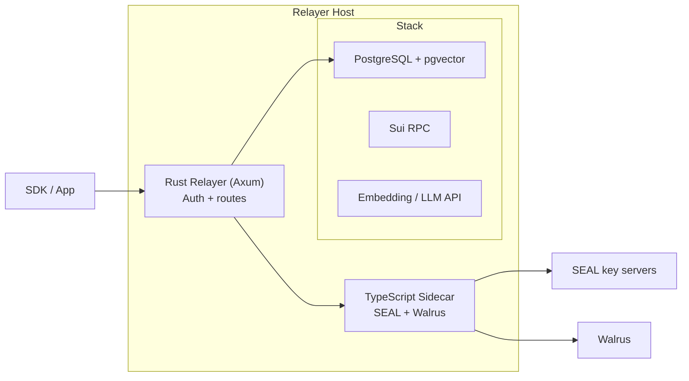

> For the complete documentation index, see [llms.txt](https://docs.wal.app/llms.txt)

The relayer is the backend that turns SDK calls into memory operations. Using a delegate key signed by the client, it handles the critical workflows, embedding, encryption, storage, and search, on behalf of the user.

## What it does

- **Authenticates requests** by verifying Ed25519 signatures against onchain delegate keys, then resolving the owner and account context
- **Generates embeddings** for text using an OpenAI-compatible API (default model: `text-embedding-3-small`, 1536 dimensions)
- **Encrypts and decrypts** data through the Seal sidecar, bound to the owner's address and the Walrus Memory package ID
- **Uploads and downloads** encrypted blobs to Walrus, with the server wallet covering storage costs
- **Stores and searches vectors** in PostgreSQL (pgvector), scoped by memory space (`owner + namespace`)
- **Orchestrates higher-level flows** like `analyze` (LLM-based fact extraction using `gpt-4o-mini`) and `ask` (memory-augmented Q&A)
- **Restores memory spaces** by querying onchain blobs, decrypting, re-embedding, and re-indexing anything missing from the local database
- **Cleans up expired blobs** reactively, when Walrus returns 404 during recall, the relayer deletes the stale vector entries from the database

## Architecture

The relayer is a Rust service (Axum) that manages a TypeScript sidecar process for Seal and Walrus operations that require the `@mysten/seal` and `@mysten/walrus` SDKs.

[Source: relayer/overview.md](https://github.com/MystenLabs/MemWal/blob/dev/docs/relayer/overview.md)

The sidecar is started automatically when the Rust server boots and communicates over HTTP on `localhost:9000` (configurable through `SIDECAR_URL`). If the sidecar fails to start, the relayer exits immediately.

### Sui RPC Transport

The relayer reaches Sui over JSON-RPC by default. Ahead of the Sui JSON-RPC sunset in July 2026, setting `SUI_GRPC_URL` to a Sui gRPC fullnode URL switches the relayer to gRPC. This is opt-in and off by default: with `SUI_GRPC_URL` empty, the relayer keeps using JSON-RPC. When set, both the write path (Walrus register and certify, Seal, and Enoki build) and the blob query and restore path run on gRPC, so it is a single reversible switch. For configuration details, see [Self-Hosting](/walrus-memory/relayer/self-hosting) and the [Environment Variables](/walrus-memory/reference/environment-variables) reference.

## Key pool

For the `analyze` endpoint (which stores multiple facts concurrently), the relayer supports a pool of Sui private keys (`SERVER_SUI_PRIVATE_KEYS`). Each concurrent Walrus upload uses a different key from the pool in round-robin order, bypassing per-signer serialization and enabling parallel uploads.

## Rate limiting  and  abuse prevention

To prevent spam and ensure stability, the relayer implements a cost-weighted, multi-layered rate limiting system backed by a Redis sliding window.

### Cost-weighted points
Because endpoints have different computational and storage costs, they consume varying amounts of "points":
- **Heavy endpoints** (for example, , `/api/analyze` which does LLM extraction, embedding, encryption, and walrus upload) = **10 points**
- `/api/remember` (embed, encrypt, upload) = **5 points**
- `/api/restore` and `/api/remember/manual` = **3 points**
- `/api/ask` (recall + LLM answering) = **2 points**
- **Basic endpoints** (for example, , `/api/recall`) = **1 point**

### Types of limits  and  terminology
1. **Per Account (User)**: The "Account" or "User" refers to the Sui address of the actual user (identified by `auth.owner`). Account limits are:
   - **60 points / minute** (burst limit)
   - **500 points / hour** (sustained limit)
2. **Per Delegate Key (Instance)**: A "Delegate Key" is the throwaway ed25519 keypair running directly on the client instance (for example, , in a browser extension or a specific device). To mitigate the risk if a specific ephemeral delegate key is compromised, each key is independently limited to **30 points / minute**.
3. **Storage Quota**: Each account is limited to a total of **1 GB** of Walrus blob storage.

For self-hosted deployments, *all* of these limits and quotas can be fully configured through environment variables. See [Self-Hosting](/walrus-memory/relayer/self-hosting) for configuration details.

## Single-instance design

Each relayer deployment is tied to a single Walrus Memory package ID (`MEMWAL_PACKAGE_ID`). The package ID is used for Seal encryption key derivation and Walrus blob metadata. Queries in the vector database are scoped by `owner + namespace`, while the package ID provides cross-deployment isolation at the encryption layer.

> **Note**
>
> The current relayer only supports a single active package ID at a time. If you deploy a separate Walrus Memory contract, you need to run a separate relayer instance with its own database.
## Trust boundary

In the default SDK path, the relayer sees plaintext data because it handles encryption and embedding on your behalf. This is a deliberate trade-off for developer experience, it means Web2 developers don't need to manage cryptographic operations.

If you need to minimize this trust, you can [self-host](/walrus-memory/relayer/self-hosting)
the relayer, run the [TEE deployment pattern](/walrus-memory/relayer/nautilus-tee),
or use the [manual client flow](/walrus-memory/sdk/usage/memwal-manual) to handle encryption
and embedding entirely on the client side. See
[Trust  and  Security Model](/walrus-memory/fundamentals/architecture/data-flow-security-model)
for the full breakdown.